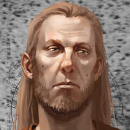

# Altari (AT)

| Name                  | Race       | Class   | Portrait            | Last Campaign | Status |
| --------------------- | ---------- | ------------- | ------------- | --------------| -------|
| Altari (pronounced _Al-Tar-E_) | Variant Human      | Cleric    |  | Lost Mines of Phandelver| Alive |

## Backstory
- Believed to be a distant Ancestor of Eldrus Wands (i.e. Eldrus Sunstaff) who is the founder of the House Wands of Waterdeep and bore many children.
- Waterdeep is where Altari met Lítið (LT) and became close friends during childhood. When asked to assist on his quest to civilize Phandalin Altari said he would meet him after he had honed his magic abilities.
- **Studied Orc** Language after seeing them devastate nearby towns and cities.
- **Twilight Divine Domain**: The twilit transition from light into darkness often brings calm and even joy, as the day's labors end and the hours of rest begin. The darkness can also bring terrors, but the gods of twilight guard against the horrors of the night. Clerics who serve these deities-examples of which appear on the Twilight Deities table-bring comfort to those who seek rest and protect them by venturing into the encroaching darkness to ensure that the dark is a comfort, not a terror.
- Since LT died during the campaign AT had to come in and assist the party.
