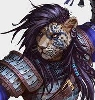
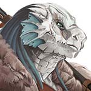
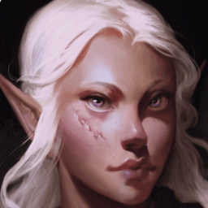
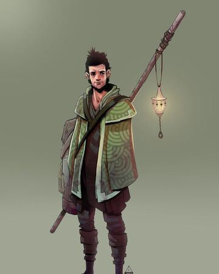

###### [&#9754; _Back to Main Page_](https://jackphillipsjmu.github.io/dnd)

# Tomb of Annihilation Campaign Notes
_Notes for the Tomb of Annihilation Campaign_

### Characters

| Name                  | Race       | Class         | Portrait                |
| --------------------- | ---------- | ------------- | ----------------------- |
| Freya Cimrari         | Human      | Monk          |  |
| Virra Wildwander      | Tabaxi     | Fighter       |  |
| Norixius Rezena (Rez) | Dragonborn | Paladin       |  |
| Pan Galanodel         | Wood Elf   | Druid         |  |
| Skógur Strákar (_translation Forest Lad_)          | Wood Elf   | Monk    |  |

---
## Session One

### Baldurs Gate
- Attend funeral of Hamwert
- As we were spending time in Baldurs Gate we've heard of a "Death Curse"
- Can never be raised again from the dead
- Seems to be impacting the entire world so a lot of people are concerned
- Everyone is at a loss of what is going on and what to do
- Couldn't figure out a way to slow Hamwert's degredation
- Similar to the magic of lichs
  - Corpsewood to the south may have an understanding of the death curse
- Remallia Haventree
  - Member of the Harpers
  - Hamwert was a member of the Harpers
  - Friend with her is suffering from the death curse
  - Sun Elf from the far East
- Harpers
  - Alliance of spell casters/spies
  - Help the weak, poor and oppressed
  - Only confront enemies as a last resort which in the case of the death curse is something they want to take action on
- Will be protections around the lich
  - Plan is to distract the more dangerous foes
  - Get the stuff quick to spare Harper lives
  - Healing potions for all!
- Go to the Horned Antelope for drinks
  - Winna
  - Realize that it's a pretty diverse city based on the crowd at the bar
- Callabrax Copperkettle - halfling wizard from Harpers
  - Can move supplies easily with his powers
  - Diviner is the ship we're using to set off from Baldurs Gate
- Syndra Silvane - older woman suffering from death curse; wears silver mask when in public
- Jagged Leaf - Tabaxi we met in the bar
- Aid is cast on us that grants us 5 additional health

#### Quest for the Phylactery

#### Skull Door Encounter
- Eyes with a greenish aura to them
- Skull inlaid into the door
- Move on from here

#### Exploration
- Red mushrooms seems to be just a mossy type shroom.
- Just a little bit bio-luminescent
- Search for ammo after combat

#### Second Door
- Second Door that we don't go into
- Can't tell what the creature is in the cavern
- Kraken splitting a ship in half on the door  

### End Notes
- Trying to steal the Phylactery which pushed us to level 2
- Traps and a Spectre encountered
- Best to have Lock Picking Skills

------------
## Session Two
- At The Cloakwood where we left off from the previous session. We're there because of Remy to get a spell book and learn more about the Death Curse from a lich
- Fighting the lich, we stole the spell book that is bound in human skin
- Cracking sounds and a women appears, half beautiful, half corpse but still alive after the fight who is the lich (bloodied)
- Book to be used as a bargaining chip to learn about the death curse from the lich
- Death Curse: Necromantic device called the soul mongerer, purpose is unclear, amount of dark energy gathered by it would power an undead being that this Earth has never seen
  - Location is in the South West of Chult
  - Lich corpse lady can't die so doesn't really care about the Death Curse
  - Death Curse seems recent, lich has never came across something like it before
  - Sudo dragon poofs onto her shoulder and they leave after we give her back the Phylactery book (potential familiar)
- Syndra Silvane teleports us to a lavish manor
  - Syndra has a silver mask to hide her decaying face from the Death Curse
  - Spill wine, but she makes the stain goes away magically, other servants in the house clean up after us as well
  - Sit down to discuss the Death Curse and Chult
  - Syndra is a bit of a cartographer and has a map we can use but is not complete
    - Leather bound cylinder that has a map of Chult with what Syndra has charted so far is given to the party
    - Chult: Nothing known about the geography except for the coast
  - Successfully disposing of Death Curse will grant us a rare magical item
  - Wakanga O’tamu (Merchant Prince) who we can meet up with. Help with supplies and maybe navigate Chult
  - 7 Merchant Princess that own different kinds of trade, folks in Chult don't take kindly to stealing
  - Contacted companion Captain Zeed who runs a ship the Windwaker which will take us to Chult (sup Link?)
    - He is a Aarakocra, i.e., Bird person
    - Kir Sabal, Zeed's hometown
  - Told to take our time when we land. Exploration will be key I reckon
  - Look at the Red Bazar for goods to be used on the jungle adventure
  - 50 Gold Pieces from Syndra
  - May meet us at Port Manzara
  - Pirates around Chult
  - All princess live in the northern part of town, markets and taverns are in the south.
  - Leave mansion (nice part of town)
- Satyrs, race of Fey
  - Satyrs are raucous fey that resemble stout male humans with the furry lower bodies and cloven hooves of goats. They frolic in wild forests, driven by curiosity and hedonism in equal measure.
  - Pan/Olivia is now a member of the Circle of Dreams: Druids hail from regions that have strong ties to the Feywild and its dreamlike realms. The druids’ guardianship of the natural world makes for a natural alliance between them and good-aligned fey. These druids seek to fill the world with dreamy wonder. Their magic mends wounds and brings joy to downcast hearts, and the realms they protect are gleaming, fruitful places, where dream and reality blur together and where the weary can find rest.
- Pan has a familiar Artemis (fay owl) dark blue who can help us scout the location
- Bought short bow, Long bow and 200 arrows at a discount and split among Skogur and Freya
- Stop into inn (Hydra and Hair/Heir/Hare?)
- Learn of a few people from the inn ZooKeeper
  - Cleric in red robes came through Hydra inn and spoke of a God in Chult Ubtao (maze god) if you make it through/trace a path in a maze you'll earn the Gods favor
  - Druid came through talking about nature spirits that the jungle is filled with. Tiny white masked creatures but they are not harmful. Druid was an elderly human woman with deep scars in both of her cheeks from claws.
- Dwarf (help at the inn) Bartholomew insults Pan's name cause he's a darsh
- Have some food and drinks after figuring out they don't really prepare dragons
- Purchase lodging for the night, grants us access to the bath house
- Go to bath house in the inn
  - Cannon ball splashes water onto 2 other bath patrons, Arnwund and Gauwis, who scowl at me
  - Olivia (Pan) turns into a pink spider to listen to them
  - They're talking about the Flaming Fist, the mercenary company they work for. Liara (head lez) heads up Flaming Fist in Chult
  - Fort Beluarian
  - Mezro
  - Talk of exotic creatures/foes like a Panther with snakes growing out of his shoulders. Flying dinosaur creatures that ripped apart their companion
  - Who ever is on the next expedition to the hidden city should go with caution
  - Both Rez and Pan stick up for Skogur as he is aloof and scrubbing his nasty feet
- Virra gets studded armor even after the shop keeper insults her smell
- Rez bought a battle axe
- Pan gets a trinket from the shop keeper because it's pretty
- Picked up 5 viles for Rez at the shop
- Got Green Goo from enhancing the Green Mushrooms we found in the first session. Grants 1d4 + 1 health each
- Purple berries (1 hit point) we each get 2 but they expired on our journey so use them before they spoil
- Got on boat and about a week in some fish people board the deck and try to attack us. Handled nicely and fled after the initial encounter even after Pan was knocked overboard and was trying to gain the favor of sharks that are aligned with the fish folk
- Just about reaching the coast the crew of the ship goes below deck to get the offering together for the water dragon. Rez is a dragon so maybe we can bargain later on or something along those lines
- Thugs board the ship and want to steal our booty
- Bigger ship is approaching during combat
- Freya after attacking some of the thugs dashes to get the other below deck to help
- Skogur is down on the deck of the boat after getting clapped up by a thug.
- Aremag, Water Turtle Dragon is asking for "Tribute" in Draconic so Rez can understand
  - Knocks a thug into the water when it emerges from the depths

------------
## Session Three

### Changes
- Maximize the dice value for potions
- Flanking now provides a +2 to hit. Flanking is when two characters are directly across from each other with an enemy in the middle. This can be used by enemies too.

### We're on a Boat
- Aremag joins combat after rocking the ship back and forth causing a thug to fall overboard.
- Pan heals two folks in one turn like a boss.
  - Gives life to Skogur with the stickiest of the icky (+9 HP, pretty strong THC %).
  - Heals Rez with +6 HP as the herb supply was running low from darting across the ship with a lit spliff.
- Boat starts to spin by Aremag swimming around the ship which makes the Thugs begin to run away.
- Rez tells a Thug to throw themselves over using "Command" which succeeds and they are eaten by Sharks (unknown if lasers equipped to the tops of their heads).
- Captain Zeed throws the doubloons over as tribute but Aremag says it's not enough showing its true turtle nature.
- Rez tries to persuade Aremag but it is not successful but lets Rez know that it will let them know when it has enough booty.
- Pan gives 49 Gold pieces to Rez who offers it to Aremag and requires one more Gold piece. Freya gives up the last Gold piece, puts them all in the treasure chest and throws it overboard onto the dragon turtles back.
- Arameg leaves, causing the boat to rock and shake avoiding all common courtesy with a graceful exit.
- We're about to Chult and Captain Zeed says he wants us to introduce us to someone due to how we handled the pirate thugs. This is Zyndar who runs the Port Nyanzaru docks.

### Arrival in the Port
- City is bustling with life and energy.
  - Street merchants, performers, random unsupervised children dot the landscape.
  - Fishy, Herbaceous and other smells waft over our noses.
  - Hot in this Rhino, water will be important!
- Captain Zeed says to check out Kir Sabal (former home in Chult) and also if we come across Syndra and we need Captain Zeed to let her know and she can contact him. From there he introduces us to Zyndar and heads back to his ship the Windwaker.
- Meet with Zyndar
  - Dragonborne, gold-ish colored with a scepter with a green spherical top
  - Tells of 3 Pirate Captains, don't know where they reside but should have a base of operations along the coast. Offers mad scrilla for helping rid the pirates from the area.
    - Bounty of 2,000 Gold each for each Pirate ship brought in - Pirates of the Caribbean, Death Curse.
    - 500 Gold pieces for Pirate Captains that are brought in.
    - Aware of 2 Pirate Captains, Elok Jaharwon (Dragonfang) and Captain Laskilar (Stirge)
    - Pirate Captains have an alliance and some magic capabilities to assist them
  - Begins to talk of the Fresh Merchant Princes of Bel-Chult and not to make trouble in their neighborhood.
    - There is a black market but if we're caught the consequences could be dire. Typically, you'll be thrown into Executioners Run which is a gauntlet viewed as a kind of sport. You have to make it from one end to the other fighting off beasts or it's yo, holmes smell you later.
    - 7 Merchant Princes, each with a different trade good who live in the north of the city in the Merchants Ward. If we want an audience with them we can head to the Golden Throne (number 1's only).
      - Ekene-Afa: Weapons, Shields, modes of Transportation like canoes and such.
      - Ifan Talro’a: Beasts for purchase.
      - Jessamine: Sanctioned murders and assassinations. Don't see them often because if you survive an assassination you can pay a higher price to assassinate the other party. Knows of poisons/other ways to take care of people.
      - Jobal: Don't cross Jobal, the wilderness guide, he seems to be a dick. But he can provide guides when going through the wilderness of Chult.
      - Kwayothé: Wine, ale, rain catchers (reduce risk of drinking infected water), bug spray's, etc. that can help throughout the journey. Help fight off throat leaches and other nasty things. Tej is the honey brew of choice in Chult.
      - Wakanga O’tamu: Magic and lore, potions, always interested in discovering about the magical aspects of Chult.
      - Zhanthi: Friend of Zyndar who deals in Gems, jewelry, clothes and armor.
        - Tells armored members in party to perhaps lighten their armor to reduce the risk of dehydration.
  - Tell Zyndar that we're here to stop the Death Curse.
  - Zyndar gives information about Chult's history
    - Previously a noble settlement based on Gold, overthrown by Foreign Power which was then taken over by the Merchant Princes. Now, the have monopoly's across Chult
  - Water seems to be pretty important, whether it's safe to drink, dehydration, etc. no Gatorade just H20.
  - Gives us some flyers/handouts on guides (available in the journal tab in VTT) to help assist us on the journey. They are all employed by Jobal except for River Mist and Flask of Wine.
    - Azaka Stormfang: 5 gold pieces per day, upfront 30 day payment. Can get around payment by helping her with a personal task. Fighter that is good in battle and one of Jobal's most popular guides.
    - Eku: 5 gold pieces per day, upfront 30 day payment. Wants to do good in the world and rid the jungle of evil. Pays a portion to Jobal and the rest she donates to the church.
    - Faroul and Gondolo: Just nah, I mean, look at them.
    - Hew Hackinstone: Tough dwarf, seent all parts of Chult and had his arm bitten off by a dragon
    - Qawasha and Kupalué: Gawasha, druid member of the Emerald Enclave. Vegepymy companion with experience in local flora and fauna. 5 gold pieces per day but this can be negotiated if we help destroy any undead we encounter. Blessing of chwingwa spirits that watch over the sacred land.
    - River Mist and Flask of Wine: May put us on the wrong side of Jabol if we go with them
    - Salida: Talks mad smack about everyone, potential Dwarf racist
    - Shago: Member of the Flaming Fist, seems pretty sketchy
  - Top 2 Guides: Eku, Qawasha and Kupalué
    - Eku typically at House of Repose
    - Qawasha and Kupalué Fort Beluarian known to live on the outskirts with his companion. Don't believe they are a part of the Flaming Fist
  - Need to get charter from Flaming Fist to avoid catching a Flaming Fist during our travels.

### Exploring the Port
- Head to market for supplies and other things. Portraits of dinosaurs and other Chult' people are all around the city highlighting it's history. Town people are v Arabian Nights in terms of dress so it's like Gladiator met Indiana Jones.
- City well equipped to deal with rain. Every building has drains to fill buckets, fountains and wheels to make use of the rainfall, deluges, etc.
- Pack of lizards with riders come through the city streets but people aren't too concerned initially.
  - One lizard, Deinonychus, bucks their rider Makao off and combat begins. Makao, the rider, is still alive and is about to be attacked by the lizard.
  - The party tries to reason/animal handle the lizard but it's not having none of it. Luckily, the lizard gets totally netted by Virra.
  - NOTE: If a creature takes an opportunity attack during their turn for another member of the party then  they cannot do so afterwards
  - Lizard breaks free of the net and starts to run away but we stop it and get it bloodied so the lizard lays on the cobblestone.
  - Guards come over and say to get away but Makao says it will be fine and he'll return the lizard to the training pit. Notices that a jewel is missing from the lizard (maybe helps to control them?) but seems to be fine now so they let us go.
  - Makao says he started training a month ago and thought the beast was ready but clearly was not.
    - Offers a drink and for us to ride in dinosaur races (next one is in 3 days)
    - Suggested Inns: Thundering Lizard, House of Repose (Eku location)

### House of Repose
- Makao leaves us for a moment to go put his mount back in the training pit.
- Roll 1d8 then 8d8's upon entry.
- Assortment of people sipping their drinks. Tabaxi minstral on lute in the corner, Half-orc priest at the bar, bombastic human speaking to the bar at large, gnome tinkerer, and Eku.
- Sit down and hear the human selling to purchase the Volo's Guide to Monsters and offer other information
  - Human, Volothamp “Volo” Geddarm is from the Sword Coast and is an explorer. Kind of a pompous bro, but seems to be telling the truth.
  - Says he is famous and offers to sign the Guide if we'd like. and is welcome among the Merchant Prince's
  - Accepts emerald and 35 Gold Pieces for the guide. Now if an enemy is in the book we will know about it which is useful
  - Get some more info from Volo.
    - Chult had many kings and queens, but none more beautiful than Queen Zalkoré. Thousands of warriors killed and died for her, but the only memorial of her reign is the garden palace of Nangalore, which lies near the eastern shore of the River Olung, north of Lake Luo. Definitely has a crush on Zalkoré.
    - A ruined city lies up the River Tath, past Kahakla Gorge. Supposedly, no one’s explored past the gorge, but that’s not true. It’s just that the few who made it out alive mostly keep quiet about what they found there. I have it on good authority that the ruins are guarded by a naga who is both wise and generous.
- Virra begins to play music and is offered to shred for money with the Tabaxi later on if that is of interest.
- Makao comes into bar and buys a keg from the crew
- Pan flirts with Makao and gives him her bobble, still don't know if Makao handed over Roman Numeral number or not for a date.

#### Speaking with Eku
- Well versed with Chult, lived their all her life from Mbala
- Has seen evil risen in Chult and wants to rid the are of it. A person did the people of Mbala wrong by deceiving them. Not sure if they are still there or not.
- Not as powerful as other guides but does have casting ability (cure wounds, poison) knows of flora and fauna in the area
- Her main primary driver is to rid Chult from evil

#### Speaking with Gnome Tinkerer
- Virra goes over to gnome tinkerer Sonny
  - Asks him in gnomish what he's working on and he says that it is just a contraption for his children.
  - He helped rig up water mills and contraptions to harness rain water and lives in Merchant Ward with his family.
  - Has the ability to disarm traps. Common traps are laid traps (pressure traps) if you block/jam the portion of the trap with something you won't get hit by it.
  - Virra gives him her bobble, no phone number either unfortunately.

#### Speaking with Inete   
- Pan speaks with Inete a Chult Acolyte
  - Why are they there? Grew up in Chult, an Acolyte of Savras, mages and wizards, symbol is the all seeing eye.
  - Works with Grandfather Zitembe, has been receiving some disturbing visions. Don't know much about his visions but may be useful to talk to him about it. Located near the Merchants Ward.
  - Inete has had disturbing visions as well of red-robed wizards operating a secret base somewhere in the Aldani Basin.

#### Back at the Table
- Makao teaches us a Chult drinking game involving coins while drinking and enjoying the honey brew.
- Half-orc priest with a gauntlet on her chest approaches us asking if we're adventurers.
  - Undril Silvertusk is a member of the order of the Gauntlet and overheard that we'd be adventuring in the forest soon. She has come to rid Chult of the undead and also help out a local Camp who are in need. Her initial plan was to go out on her own with a horse but the terrain is too hazardous to do so and wants us to join in her quest.
  - Two camps are Camp Righteous and Camp Vengeance. Undril needs to deliver herself plus a packet of dispatches from her superiors to Commander Niles Breakbone at Camp Vengeance.
  - Noble member and is not looking for gold or valuables.
  - Not familiar of the guide Qawasha of the Emerald Enclave who also wants to rid the area of the undead.
  - Tried to go out on their own with a horse but the terrain is too hazardous to do so and wants us to join in her quest.
  - Divine magic capabilities, mace and shield. Similar heavy armor as Rez so may need to change that up - shopping!

#### Getting Ready to Head Out
- Makao leaves us and says that a race is in 3 days but have races every week. Can earn money and also help gain favor with a Merchant Prince.
- After discussing next steps we think it's too much of a hassle to journey to get the charter and talk to Qawasha and Kupalué so we'll try to hitch a ride with Captain Zedd.

### Back to the Streets of Chult
- We begin on our way back to the Harbor to get a ship with Undril joining us.
  - Older man with eyes rolled back in their head goes over to Rez telling her, "Speak to the wise guardian of Orolunga, west of Mbala. She can direct you to that which you seek". Rez inspects the man and his eyes clear and seems to know nothing of what he said or has been doing. Undril Silvertusk tells us to be cautious as we don't know who was controlling him.
  - See Coliseum and hear cheering coming from it. As we make our way around we hear murmurs about the Grand Suke (sp?), where curated goods are sold (spices, medicines, monkeys, unicorn easter bunnies) compared to the market which is more clothes and armor.
  - Notice the map Syndra gave Rez is missing and someone is sprinting away from us.

**Next Session will be next Saturday at 1:30 pm!**

------------
## Session Four

### The Chase is On
- Water spills as Freya is dashing towards the the thief but dodges it
- Rez encounters a swarm of bugs and can either go around or charge through them. She chooses to go around the bugs.
- Cart moves in front of Pan full of gardening tools and Pan attempts to jump over it which is good!
- Skogur slashes the running away thief and watches as they run into a swarm of bugs worrying about getting away.
- Merchant drops a bunch of coins but Virra ignores this and continues the chase.
- Pan can't intimidate the crowd and causes her movement to be limited.
- Spy/thief goes down alley way after disengaging after passing a beast with a little tap on the head.
- Freya catches the Spy with her trident.
- Shaved head person who doesn't want to give up the name of who they're working for.
  - Eyes have an odd pigmentation almost un-human like
  - Does not work for the Flaming Fist and doesn't seem to know about the Death Curse.
  - Evaporates and only their cloak is left and a snake is slithering away.
  - Arrow flies in and pierces the enemy in the head and reverts to its "human" shape.
  - Arrow came from somewhere in Malar's Throat.
  - "Ras Nsi" ("Ras-me-see") is spoken by the Spy as they die.  - Scales along their back like a snake.
  - Likely a Yuan-ti which are serpent folk. Many different kinds but this one seems to be a pureblood. Their people have a hierarchy, the closer you are to being a snake then the higher you are in the ranks.
   - Dendar, Merrshaulk, and Sseth are the 3 Gods they serve.

### Retail Therapy
- Head to Red Bazar to go shopping
- Purchase 2 Rain Catchers (Undril purchases 1 Rain Catcher and Salve) -
  - Simple contraption consisting of a 5-foot-square leather tarp and a wooden frame with legs. When the tarp is stretched across the wooden frame, it forms a basin that can catch 2 gallons of drinking water per inch of rainfall and hold up to 8 gallons. The tarp and wooden frame fold up for easy transport. Only works when raining!
- Looking for Bug Repellent
  - Salve (1 Gold, 20 applications) to apply to yourself or a block of incense (1 Silver, lasts 8 hours, but does not protect against large bugs)
  - Each purchase 1 Salve a piece and 1 block of incense for the group.
- Start searching for armor
  - First booth is a bit too pricy for us so we pass this up.
  - Purchase nice looking fabrics to become gorgeous.
  - Rez trades her chain mail for studded leather armor and 25 GP - looks fantastic.
- Skogur purchases some sweet sandals for 2 GP to cover up his nasty feetscicles.

### Executioners Run - The Runnining
- Belym tells the crew that their Husband (Draza) wasn't guilty of stealing but was wrongly accused and put into Executioners Run against Velociraptors (Deinonychus) Jurassic Park style.
  - Only have 25 SP to offer like a peasant so we don't accept the payment to save him.
- 2 Deinonychus in the pit with 3 people attempting to making it across.
- Get Draza out of the pit by using Pan's whip-it-good skills.
- Belym works under Jessamine and can help us get an appointment with her at Golden Throne (not for number 2's).
- Beggar Princes run Executioners Run (think of themselves as their own Merchant Princes)
- Go to the Thundering Lizard with Belym and Draza (very Coyote Ugly).
  - Greeted by 2 Tabaxi's who offer Virra a drink.
  - Able to get a Long Rest

------------
###### [&#9754; _Back to Main Page_](https://jackphillipsjmu.github.io/dnd)
