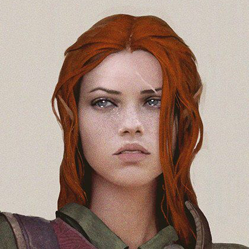
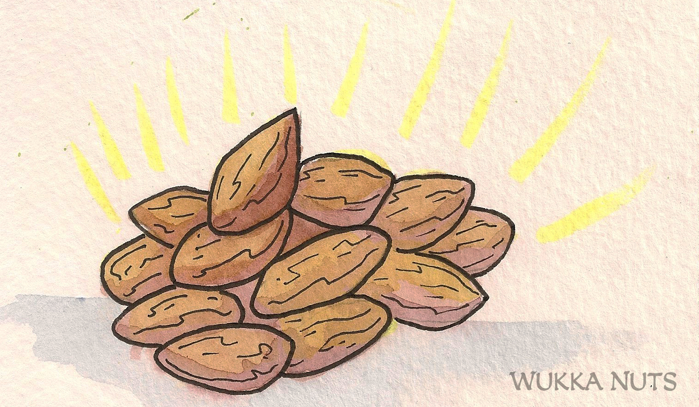

###### [&#9754; _Back to Main Page_](https://jackphillipsjmu.github.io/dnd)

# Tomb of Annihilation Campaign
_Compiled Notes for the Tomb of Annihilation Campaign_

### Characters

| Name                  | Race       | Class         | Portrait                | Status |
| --------------------- | ---------- | ------------- | ----------------------- | ------ |
| Freya Cimrari         | [Human](https://forgottenrealms.fandom.com/wiki/Human) | [Monk](https://forgottenrealms.fandom.com/wiki/Monk) |  | Alive &#128512; |
| Virra Wildwander      | [Tabaxi](https://forgottenrealms.fandom.com/wiki/Tabaxi)     | [Fighter](https://forgottenrealms.fandom.com/wiki/Fighter) |  |  Alive &#128570; |
| Norixius Rezena (Rez) | [Dragonborn](https://forgottenrealms.fandom.com/wiki/Dragonborn) | [Paladin](https://forgottenrealms.fandom.com/wiki/Paladin)       |  |  Alive &#128512; |
| Pan Galanodel         | [Wood Elf](https://forgottenrealms.fandom.com/wiki/Wood_elf)   | [Druid](https://forgottenrealms.fandom.com/wiki/Druid) |  |  Alive &#128512; |
| [Skógur Strákar](skogur_character_notes.md) (_translation Forest Lad_) | [Wood Elf](https://forgottenrealms.fandom.com/wiki/Wood_elf) | [Monk](https://forgottenrealms.fandom.com/wiki/Monk) |  |  Alive &#128512; |

## Session Notes
- [**Session One**: In the Beginning, there are 5 adventurers.](#session_one)
- [**Session Two**: Land to Sea](#session_two)
- [**Session Three**: The Turtles are Huge Near Chult](#session_three)
- [**Session Four**: Snake People and Dinosaurs](#session_four)
- [**Session Five**: I'm Not Drunk, You're Drunk Veggie Man!](#session_five)
- [**Session Six**: Let's go to the Winchester, have a nice cold pint, and wait for this all to blow over.](#session_six)
- [**Session Seven**: Rags to Riches](#session_seven)
- [**Session Eight**: Run the Jewels](#session_eight)
- [**Session Nine**: Jungle Boogie (Part 1)](#session_nine)

---
## Session One
_Note that this first Session notes aren't as well rounded as the others but may provide some insights._

### Level Setting the Campaign
- **This campaign is famous for killing characters!**
- Start the campaign at Hamwert's funeral (the person who connects all of our characters together) so be prepared to speak.
- Inspiration: Lets you roll any D20 and then it's gone but can be given out for good role playing (get into character!).
- Advantage: Will be checking abilities for different behaviors (leap off a tree to attack, give an acrobatics check)
- No Phones during sessions.
- Ranked Pillars for what we want out of the Campaign: Role Playing, Combat, Exploring.
- Resources such as Arrows, Meal Rations, etc. will be consumed as you use them. For instance, if you fire an arrow and it breaks or cannot be retrieved then it must be removed from your inventory.
- [Reference Cheat Sheet (Movement, Action, Condition, etc.)](https://crobi.github.io/dnd5e-quickref/preview/quickref.html)
- Games are hosted on the DM's [Foundry Virtual Tabletop (VTT)](https://foundryvtt.com/).

### Baldurs Gate
- Attend funeral of Hamwert
- As we were spending time in Baldurs Gate we've heard of a "Death Curse"
- Can never be raised again from the dead
- Seems to be impacting the entire world so a lot of people are concerned
- Everyone is at a loss of what is going on and what to do
- Couldn't figure out a way to slow Hamwert's degradation
- Similar to the magic of [lich's](https://www.dndbeyond.com/monsters/lich)
  - Corpsewood to the south may have an understanding of the death curse
- **Harpers**
  - Alliance of spell casters/spies
  - Help the weak, poor and oppressed
  - Only confront enemies as a last resort which in the case of the death curse is something they want to take action on
- **Remallia Haventree**
  - One of the Harper leaders.
  - Sun Elf from the far East
  - Hamwert was a member of the Harpers
  - Friend with her is suffering from the Death Curse
- Will be protections around the [lich](https://www.dndbeyond.com/monsters/lich)
  - Plan is to distract the more dangerous foes
  - Get the stuff quick to spare Harper lives
  - Healing potions for all!
- Go to the Horned Antelope for drinks
  - Winna (no idea what this is about)
  - Realize that it's a pretty diverse city based on the crowd at the bar
- **Zaldara Cordress**: [Lich](https://www.dndbeyond.com/monsters/lich) from the Corpsewood
- **Callabrax Copperkettle**: Halfling wizard from Harpers
  - Can move supplies easily with his powers
  - Diviner is the ship we're using to set off from Baldurs Gate
- **Syndra Silvane**: Older woman suffering from death curse; wears silver mask when in public
- **Jagged Leaf**: Tabaxi we met in the bar (_Drinks on Jagged Leaf next time!_)
- Aid is cast on us that grants us 5 additional health

#### Quest for the Phylactery

#### Skull Door Encounter
- Eyes with a greenish aura to them
- Skull inlaid into the door
- Move on from here

#### Exploration
- Red mushrooms seems to be just a mossy type shroom.
- Just a little bit bio-luminescent
- Search for ammo after combat

#### Second Door
- Second Door that we don't go into
- Can't tell what the creature is in the cavern
- Kraken splitting a ship in half on the door  

#### Notes from Pan Galanodel
- Entered bottom level of tower, fought skeletons
- Explored and fought a blue cube (Pan collected a sample)
- Green mushrooms give back hp! Mushrooms good!
- Found two blocked/locked doors: one w a skeleton and another with an arcana symbol above it and a Kraken. When we tried to bust through the door a necrotic tentacle would come out
- Broke down the kraken door and went inside - explored and took down 3 ghouls, Virra poisoned herself by eating one of the human legs a ghoul was eating
- Kept going through the tower and met a dragon that used to be the pet of Zaldara. Led us to where the Phylactery (spell book) was kept
- Fought against spooky dude in Phylactery room and disabled the traps
- Got 3 new spells and gold inside of the Phylactery chest
- Headed back out to meet Callabrax
- Ran into armored dude and solved his riddle in order to escape!

### End Notes
- Trying to steal the Phylactery which pushed us to level 2
- Traps and a Spectre encountered
- Best to have Lock Picking Skills
- **Upgrade to Level 2!**

[_Back to Top_](#top_of_page)

------------
## Session Two

### Learn from the Lich
- At The Cloakwood where we left off from the previous session. We're there because of Remy to get a spell book and learn more about the Death Curse from a [lich](https://www.dndbeyond.com/monsters/lich)
- Fighting the lich, we stole the spell book that is bound in human skin
- Cracking sounds and a women appears, half beautiful, half corpse but still alive after the fight who is the lich (bloodied condition)
- Book to be used as a bargaining chip to learn about the death curse from the lich
- **Death Curse**: Necromantic device called the soul mongerer, purpose is unclear, amount of dark energy gathered by it would power an undead being that this Earth has never seen
  - Location is in the South West of Chult
  - Lich corpse lady can't die so doesn't really care about the Death Curse
  - Death Curse seems recent, lich has never came across something like it before
  - Sudo dragon poofs onto her shoulder and they leave after we give her back the Phylactery book (potential familiar)

### Mind Your Manor
- Syndra Silvane teleports us to a lavish manor
  - Syndra has a silver mask to hide her decaying face from the Death Curse
  - Spill wine, but she makes the stain goes away magically, other servants in the house clean up after us as well
  - Sit down to discuss the Death Curse and Chult
  - Syndra is a bit of a cartographer and has a map we can use but is not complete
    - Leather bound cylinder that has a map of Chult with what Syndra has charted so far is given to the party
    - Chult: Nothing known about the geography except for the coast
  - Successfully disposing of Death Curse will grant us a rare magical item
  - Wakanga O’tamu (Merchant Prince) who we can meet up with. Help with supplies and maybe navigate Chult
  - 7 Merchant Princess that own different kinds of trade, folks in Chult don't take kindly to stealing
  - Contacted companion Captain Zeed who runs a ship the Windwaker which will take us to Chult (sup Link?)
    - He is a Aarakocra, i.e., Bird person
    - Kir Sabal, Zeed's hometown
  - Told to take our time when we land. Exploration will be key I reckon
  - Look at the Red Bazar for goods to be used on the jungle adventure
  - 50 Gold Pieces from Syndra
  - May meet us at Port Manzara
  - Pirates around Chult
  - All princess live in the northern part of town, markets and taverns are in the south.
  - Leave mansion (located in a nice part of town)

#### Pan Satyr Background
- Asks Skógur if he knows what Satyrs are (race of Fey)
  - Satyrs are raucous fey that resemble stout male humans with the furry lower bodies and cloven hooves of goats. They frolic in wild forests, driven by curiosity and hedonism in equal measure.
  - Pan is now a member of the Circle of Dreams: Druids hail from regions that have strong ties to the Feywild and its dreamlike realms. The druids’ guardianship of the natural world makes for a natural alliance between them and good-aligned fey. These druids seek to fill the world with dreamy wonder. Their magic mends wounds and brings joy to downcast hearts, and the realms they protect are gleaming, fruitful places, where dream and reality blur together and where the weary can find rest.
- Pan has a familiar Artemis (fay owl) dark blue who can help us scout the location

### To the Inn
- Bought short bow, Long bow and 200 arrows at a discount and split among Skógur and Freya
- Stop into inn (Hydra and Hair/Heir/Hare?)
- Learn of a few people from the inn ZooKeeper
  - Cleric in red robes came through Hydra inn and spoke of a God in Chult Ubtao (maze god) if you make it through/trace a path in a maze you'll earn the Gods favor
  - Druid came through talking about nature spirits that the jungle is filled with. Tiny white masked creatures but they are not harmful. Druid was an elderly human woman with deep scars in both of her cheeks from claws.
- Dwarf (help at the inn) Bartholomew insults Pan's name cause he's a darsh
- Have some food and drinks after figuring out they don't really prepare dragons
- Purchase lodging for the night, grants us access to the bath house

#### Hit the Showers
- Go to bath house in the inn
  - Skógur cannon ball splashes water onto 2 other bath patrons, Arnwund and Gauwis, who scowl at me
  - Pan turns into a pink spider to listen to them
  - They're talking about the Flaming Fist, the mercenary company they work for. Liara (head lez) heads up Flaming Fist in Chult
  - Fort Beluarian
  - Mezro
  - Talk of exotic creatures/foes like a Panther with snakes growing out of his shoulders. Flying dinosaur creatures that ripped apart their companion
  - Who ever is on the next expedition to the hidden city should go with caution
  - Both Rez and Pan stick up for Skógur as he is aloof and scrubbing his nasty feet

### Retail Therapy (Round 1)
- Virra gets studded armor even after the shop keeper insults her smell
- Rez bought a battle axe
- Pan gets a trinket from the shop keeper because it's pretty
- Picked up 5 viles for Rez at the shop
- Got Green Goo from enhancing the Green Mushrooms we found in the first session. Grants `1d4 + 1` health each

### Ahoy Matey
- Get onto Captain Zeed's ship after we all take a rest.
- Pan can make purple berries (`1 hit point`) which she does. Each of us gets 2 but they expire on our journey so use them before they spoil
- Got on boat and about a week in some fish people board the deck and try to attack us. Handled nicely and fled after the initial encounter even after Pan was knocked overboard and was trying to gain the favor of sharks that are aligned with the fish folk
- Just about reaching the coast the crew of the ship goes below deck to get the offering together for the water dragon. Rez is a dragon so maybe we can bargain later on or something along those lines
- Thugs board the ship and want to steal our booty
- Bigger ship is approaching during combat
- Freya after attacking some of the thugs dashes to get the other below deck to help
- Skógur is down on the deck of the boat after getting clapped up by a thug.
- [Aremag](https://nat19.fandom.com/wiki/Aremag), Water Turtle Dragon is asking for "Tribute" in Draconic so Rez can understand
  - Knocks a thug into the water when it emerges from the depths

[_Back to Top_](#top_of_page)

------------
## Session Three

### Changes
- Maximize the dice value for potions
- Flanking now provides a +2 to hit. Flanking is when two characters are directly across from each other with an enemy in the middle. This can be used by enemies too.

### We're on a Boat
- Aremag joins combat after rocking the ship back and forth causing a thug to fall overboard.
- Pan heals two folks in one turn like a boss.
  - Gives life to Skógur with the stickiest of the icky (+9 HP, pretty strong THC %).
  - Heals Rez with +6 HP as the herb supply was running low from darting across the ship with a lit spliff.
- Boat starts to spin by Aremag swimming around the ship which makes the Thugs begin to run away.
- Rez tells a Thug to throw themselves over using "Command" which succeeds and they are eaten by Sharks (unknown if lasers equipped to the tops of their heads).
- Captain Zeed throws the doubloons over as tribute but Aremag says it's not enough showing its true turtle nature.
- Rez tries to persuade Aremag but it is not successful but lets Rez know that it will let them know when it has enough booty.
- Pan gives 49 Gold pieces to Rez who offers it to Aremag and requires one more Gold piece. Freya gives up the last Gold piece, puts them all in the treasure chest and throws it overboard onto the dragon turtles back.
- Arameg leaves, causing the boat to rock and shake avoiding all common courtesy with a graceful exit.
- We're about to Chult and Captain Zeed says he wants us to introduce us to someone due to how we handled the pirate thugs. This is Zyndar who runs the Port Nyanzaru docks.

### Arrival in the Port
- City is bustling with life and energy.
  - Street merchants, performers, random unsupervised children dot the landscape.
  - Fishy, Herbaceous and other smells waft over our noses.
  - Hot in this Rhino, water will be important!
- Captain Zeed says to check out Kir Sabal (former home in Chult) and also if we come across Syndra and we need Captain Zeed to let her know and she can contact him. From there he introduces us to Zyndar and heads back to his ship the Windwaker.
- Meet with Zyndar
  - Dragonborne, gold-ish colored with a scepter with a green spherical top
  - Tells of 3 Pirate Captains, don't know where they reside but should have a base of operations along the coast. Offers mad scrilla for helping rid the pirates from the area.
    - Bounty of 2,000 Gold each for each Pirate ship brought in - Pirates of the Caribbean, Death Curse.
    - 500 Gold pieces for Pirate Captains that are brought in.
    - Aware of 2 Pirate Captains, Elok Jaharwon (Dragonfang) and Captain Laskilar (Stirge)
    - Pirate Captains have an alliance and some magic capabilities to assist them
  - Begins to talk of the Fresh Merchant Princes of Bel-Chult and not to make trouble in their neighborhood.
    - There is a black market but if we're caught the consequences could be dire. Typically, you'll be thrown into Executioners Run which is a gauntlet viewed as a kind of sport. You have to make it from one end to the other fighting off beasts or it's yo, holmes smell you later.
    - **7 Merchant Princes**, each with a different trade good who live in the north of the city in the Merchants Ward. If we want an audience with them we can head to the Golden Throne (number 1's only).
      1. **Ekene-Afa**: Weapons, Shields, modes of Transportation like canoes and such.
      2. **Ifan Talro’a**: Beasts for purchase.
      3. **Jessamine:** Sanctioned murders and assassinations. Don't see them often because if you survive an assassination you can pay a higher price to assassinate the other party. Knows of poisons/other ways to take care of people.
      4. **Jobal**: Don't cross Jobal, the wilderness guide, he seems to be a dick. But he can provide guides when going through the wilderness of Chult.
      5. **Kwayothé**: Wine, ale, rain catchers (reduce risk of drinking infected water), bug spray's, etc. that can help throughout the journey. Help fight off throat leaches and other nasty things. Tej is the honey brew of choice in Chult.
      6. **Wakanga O’tamu**: Magic and lore, potions, always interested in discovering about the magical aspects of Chult.
      7. **Zhanthi**: Friend of Zyndar who deals in Gems, jewelry, clothes and armor.
        - Tells armored members in party to perhaps lighten their armor to reduce the risk of dehydration.
  - Tell Zyndar that we're here to stop the Death Curse.
  - Zyndar gives information about Chult's history: Previously a noble settlement based on Gold, overthrown by Foreign Power which was then taken over by the Merchant Princes. Now, they have monopoly's across Chult.
  - **Water seems to be pretty important**, whether it's safe to drink, dehydration, etc. no Gatorade just H20.
  - Gives us some flyers/handouts on guides (_available in the journal tab in VTT_) to help assist us on the journey. They are all employed by Jobal except for River Mist and Flask of Wine.
    - **Azaka Stormfang**: 5 gold pieces per day, upfront 30 day payment. Can get around payment by helping her with a personal task. Fighter that is good in battle and one of Jobal's most popular guides.
    - **Eku**: 5 gold pieces per day, upfront 30 day payment. Wants to do good in the world and rid the jungle of evil. Pays a portion to Jobal and the rest she donates to the church.
    - **Faroul and Gondolo**: Just nah, I mean, look at them.
    - **Hew Hackinstone**: Tough dwarf, seent all parts of Chult and had his arm bitten off by a dragon
    - **Qawasha and Kupalué**: Gawasha, druid member of the Emerald Enclave. Vegepymy companion with experience in local flora and fauna. 5 gold pieces per day but this can be negotiated if we help destroy any undead we encounter. Blessing of chwingwa spirits that watch over the sacred land.
    - **River Mist and Flask of Wine**: May put us on the wrong side of Jabol if we go with them
    - **Salida**: Talks mad smack about everyone, potential Dwarf racist
    - **Shago**: Member of the Flaming Fist, seems pretty sketchy
  - **Top 2 Guides**: Eku, Qawasha and Kupalué
    - Eku typically at House of Repose
    - Qawasha and Kupalué Fort Beluarian known to live on the outskirts with his companion. Don't believe they are a part of the Flaming Fist
  - **Need to get charter from Flaming Fist to avoid catching a Flaming Fist during our travels.**

### Exploring the Port
- Head to market for supplies and other things. Portraits of dinosaurs and other Chult' people are all around the city highlighting it's history. Town people are v Arabian Nights in terms of dress so it's like Gladiator met Indiana Jones.
- City well equipped to deal with rain. Every building has drains to fill buckets, fountains and wheels to make use of the rainfall, deluges, etc.
- Pack of lizards with riders come through the city streets but people aren't too concerned initially.
  - One lizard, Deinonychus, bucks their rider Makao off and combat begins. Makao, the rider, is still alive and is about to be attacked by the lizard. Finna become the [F'n Lizard King](https://www.youtube.com/watch?v=SzgG94Tz2Ak).
  - The party tries to reason/animal handle the lizard but it's not having none of it. Luckily, the lizard gets totally netted by Virra.
  - **NOTE**: If a creature takes an opportunity attack during their turn for another member of the party then  they cannot do so afterwards
  - Lizard breaks free of the net and starts to run away but we stop it and get it bloodied so the lizard lays on the cobblestone.
  - Guards come over and say to get away but Makao says it will be fine and he'll return the lizard to the training pit. Notices that a jewel is missing from the lizard (maybe helps to control them?) but seems to be fine now so they let us go.
  - Makao says he started training a month ago and thought the beast was ready but clearly was not.
    - Offers a drink and for us to ride in dinosaur races (next one is in 3 days)
    - Suggested Inns: Thundering Lizard, House of Repose (Eku location)

### House of Repose
- Makao leaves us for a moment to go put his mount back in the training pit.
- Roll 1d8 then 8d8's upon entry.
- Assortment of people sipping their drinks. Tabaxi minstral on lute in the corner, Half-orc priest at the bar, bombastic human speaking to the bar at large, gnome tinkerer, and Eku.
- Sit down and hear the human selling to purchase the Volo's Guide to Monsters and offer other information
  - Human, Volothamp “Volo” Geddarm is from the Sword Coast and is an explorer. Kind of a pompous bro, but seems to be telling the truth.
  - Says he is famous and offers to sign the Guide if we'd like. and is welcome among the Merchant Prince's
  - Accepts emerald and 35 Gold Pieces for the guide. Now if an enemy is in the book we will know about it which is useful
  - Get some more info from Volo.
    - Chult had many kings and queens, but none more beautiful than Queen Zalkoré. Thousands of warriors killed and died for her, but the only memorial of her reign is the garden palace of Nangalore, which lies near the eastern shore of the River Olung, north of Lake Luo. Definitely has a crush on Zalkoré.
    - A ruined city lies up the River Tath, past Kahakla Gorge. Supposedly, no one’s explored past the gorge, but that’s not true. It’s just that the few who made it out alive mostly keep quiet about what they found there. I have it on good authority that the ruins are guarded by a naga who is both wise and generous.
- Virra begins to play music and is offered to shred for money with the Tabaxi later on if that is of interest.
- Makao comes into bar and buys a keg from the crew
- Pan flirts with Makao and gives him her bobble, still don't know if Makao handed over Roman Numeral number or not for a date.

#### Speaking with Eku
- Well versed with Chult, lived their all her life but is from Mbala
- Has seen evil risen in Chult and wants to rid the are of it. A person did the people of Mbala wrong by deceiving them. Not sure if they are still there or not.
- Not as powerful as other guides but does have casting ability (cure wounds, poison) knows of flora and fauna in the area
- Her main primary driver is to rid Chult from evil

#### Speaking with Gnome Tinkerer
- Virra goes over to gnome tinkerer Sonny
  - Asks him in gnomish what he's working on and he says that it is just a contraption for his children.
  - He helped rig up water mills and contraptions to harness rain water and lives in Merchant Ward with his family.
  - Has the ability to disarm traps. Common traps are laid traps (pressure traps) if you block/jam the portion of the trap with something you won't get hit by it.
  - Virra gives him her bobble, no phone number either unfortunately.

#### Speaking with Inete   
- Pan speaks with Inete a Chult Acolyte
  - Why are they there? Grew up in Chult, an Acolyte of Savras, mages and wizards, symbol is the all seeing eye.
  - Works with Grandfather Zitembe, has been receiving some disturbing visions. Don't know much about his visions but may be useful to talk to him about it. Located near the Merchants Ward.
  - Inete has had disturbing visions as well of red-robed wizards operating a secret base somewhere in the Aldani Basin.

#### Back at the Table
- Makao teaches us a Chult drinking game involving coins while enjoying the honey brew.
- Undril Silvertusk, Half-orc priest with a gauntlet on her chest approaches us asking if we're adventurers.
  - Undril Silvertusk is a member of the order of the Gauntlet and overheard that we'd be adventuring in the forest soon. She has come to rid Chult of the undead and also help out a local Camp who are in need. Her initial plan was to go out on her own with a horse but the terrain is too hazardous to do so and wants us to join in her quest.
  - Two camps are Camp Righteous and Camp Vengeance. Undril needs to deliver herself plus a packet of dispatches from her superiors to Commander Niles Breakbone at Camp Vengeance.
  - Noble member and is not looking for gold or valuables.
  - Not familiar of the guide Qawasha of the Emerald Enclave who also wants to rid the area of the undead.
  - Tried to go out on their own with a horse but the terrain is too hazardous to do so and wants us to join in her quest.
  - Divine magic capabilities, mace and shield. Similar heavy armor as Rez so may need to change that up - shopping!

#### Getting Ready to Head Out
- Makao leaves us and says that a race is in 3 days but have races every week. Can earn money and also help gain favor with a Merchant Prince.
- After discussing next steps we think it's too much of a hassle to journey to get the charter and talk to Qawasha and Kupalué so we'll try to hitch a ride with Captain Zedd.

### Back to the Streets of Chult
- We begin on our way back to the Harbor to get a ship with Undril joining us.
  - Older man with eyes rolled back in their head goes over to Rez telling her, "Speak to the wise guardian of Orolunga, west of Mbala. She can direct you to that which you seek". Rez inspects the man and his eyes clear and seems to know nothing of what he said or has been doing. Undril Silvertusk tells us to be cautious as we don't know who was controlling him.
  - See Coliseum and hear cheering coming from it. As we make our way around we hear murmurs about the Grand Suke (sp?), where curated goods are sold (spices, medicines, monkeys, unicorn easter bunnies) compared to the market which is more clothes and armor.
  - Notice the map Syndra gave Rez is missing and someone is sprinting away from us.

[_Back to Top_](#top_of_page)

------------
## Session Four

### The Chase is On
- Water spills as Freya is dashing towards the the thief but dodges it gracefully.
- Rez encounters a swarm of bugs and can either go around or charge through them. She chooses to go around the bugs and not risk it.
- Cart moves in front of Pan full of gardening tools which she leaps over gracefully.
- After using his 90 feet of dash speed Skógur slashes the running away thief and watches as they run into a swarm of bugs.
- Merchant drops a bunch of coins but Virra ignores this and continues the chase.
- Pan can't intimidate the crowd and causes her movement to be limited.
- Spy/thief goes down alley way after disengaging after passing a beast with a little tap on the head.
- Freya catches the Spy with her trident.
- Shaved head person who doesn't want to give up the name of who they're working for.
  - Eyes have an odd pigmentation almost un-human like
  - Does not work for the Flaming Fist and doesn't seem to know about the Death Curse.
  - Evaporates and only their cloak is left and a snake is slithering away.
  - Arrow flies in and pierces the enemy in the head and reverts to its "human" shape.
  - Arrow came from somewhere in Malar's Throat but do not know where exactly.
  - "Ras Nsi" ("Ras-me-see") is spoken by the Spy as they die. Scales along their back like a snake.
  - Likely a [**Yuan-ti**](https://forgottenrealms.fandom.com/wiki/Yuan-ti) which are serpent folk. Many different kinds but this one seems to be a pureblood. Their people have a hierarchy, the closer you are to being a snake then the higher you are in the ranks.
   - **The Yuan-Ti Pantheon**: [Dendar](https://forgottenrealms.fandom.com/wiki/Dendar), [Merrshaulk](https://forgottenrealms.fandom.com/wiki/Merrshaulk), and [Sseth](https://forgottenrealms.fandom.com/wiki/Sseth) are the 3 Gods they serve (_potentially_).
- Check that no one really cares about a dead body, throw his robe over him and back away from the him. There's only one way to get over killing a Snake Person.

### Retail Therapy (Round 2)
- Head to Red Bazar to go shopping
- Purchase 2 Rain Catchers (Undril purchases 1 Rain Catcher and Salve)
  - Simple contraption consisting of a 5-foot-square leather tarp and a wooden frame with legs. When the tarp is stretched across the wooden frame, it forms a basin that can catch 2 gallons of drinking water per inch of rainfall and hold up to 8 gallons. The tarp and wooden frame fold up for easy transport. Only works when raining!
- Looking for Bug Repellent
  - Salve (1 Gold, 20 applications) to apply to yourself or a block of incense (1 Silver, lasts 8 hours, but does not protect against large bugs)
  - Each purchase 1 Salve a piece and 1 block of incense for the group.
- Start searching for armor
  - First booth is a bit too pricy for us so we pass this up.
  - Purchase nice looking fabrics to become gorgeous.
  - Rez trades her chain mail for studded leather armor and 25 GP - looks fantastic (_loses some AC but a price to pay to look fab_).
- Skógur purchases some sweet sandals for 2 GP to cover up his nasty feetscicles.

### Executioners Run - The Runnining
- Belym tells the crew that their Husband (Draza) wasn't guilty of stealing but was wrongly accused and put into Executioners Run against Velociraptors. Or as they are called in game, [Deinonychus](https://forgottenrealms.fandom.com/wiki/Deinonychus) - [Jurassic Park style](https://youtu.be/dnRxQ3dcaQk?t=168).
  - Only have 25 SP to offer like a peasant so we don't accept the payment to save him.
- 2 Deinonychus in the pit with 3 people attempting to making it across.
- Take down one of the Deinonychus after dropping into the pit.
- Get Draza out of the pit by using Pan's whip-it-good skills.
- Belym works under Jessamine and can help us get an appointment with her at Golden Throne (not for number 2's).
- Beggar Princes run Executioners Run (think of themselves as their own Merchant Princes)
- Go to the Thundering Lizard with Belym and Draza (very Coyote Ugly).
  - Greeted by 2 Tabaxi's who offer Virra a drink.
  - Able to get a Long Rest

[_Back to Top_](#top_of_page)

------------
## Session Five

### Thunder Dome at the Thundering Lizard
- Virra is approached by 2 Tabaxi's (Rivermist and Flask of Wine)
  - **River Mist and Flask of Wine**: May put us on the wrong side of Jabol if we go with them. River Mist is missing an eyeball (female Tabaxi) from the Death Curse. Flask of Wine isn't too talkative (Helen Keller esc?)
  - Prefer to stay off the grid to avoid the risk of the Merchant Princes. Jabol likes to behead people that cross him.
  - Fire Finger, controlled by Taradon folk (maybe treasure there)
  - Village of the Grung-Dung-Lung (Grung)
- Notice a minstrel in the corner as well.
- Roll a D8 to see who is in the bar (few people in the party but specifically [MERMAN!](https://www.youtube.com/watch?v=EoQW03UFqQw))
  - Few clerics, druid, sorcerer and a wizard
  - Miklotov Blesk and Camus Aurelius (Clerics)
  - Corvil Aronav (Triton Cleric): Long blue hair
  - Yuber Achtfach (Tiefling): Dark Purple and Blacks
  - Viki Pendragon (Flip Cup Closer, Pale White Eyes that are pretty creepy)
  - Some others I may not have caught as well.
- Recognize a guide **Azaka Stormfang**, has a quest to go to Fire Finger and is after a lost family heirloom
- Pan buys a round of Tej for the party after getting some denaro's from The Treasury of Freya (costs 10 silver, one gold)
- Corvil Aronav (can create water using a can't trip), adventurers from a patron of water deep and the group needs a guide.
  - Clear it's their first time in Chult - _who do you know here?_.
- Taking the rivers is typically effective rather than the forest.
  - Plan to follow the river Tariki
  - Area where you can buy canoes, get a dino-nug or 2 to carry their loot
- Assemble the party to play a drinking game with the other adventurers
- Continue discussion after the drinking competition

#### [Beerfest!](https://www.youtube.com/watch?v=my-VMxj6YlI)
- Pan is asked to explain a Satyr game, **Flippith thy Cup**.
  - **Rules**: No magic, a test of grossness
  - Friendly wager of 15 GP
  - **Full Cup** Flippith thy Cup!
- Rez is too powerful and can't flippith the cup after a mighty chug. Rez's mug gets pushed back against the wall and on the next flip she sends it into the ceiling. One of the adventurers Bat familiar takes it out of the ceiling but lands on the table upside down. Touchdown! Move onto Pan's turn.
- Other party seems to be cheating like some punk ass bitches
- After a dead heat in the end between Virra and Viki, we won!

#### Post-Game Like We Won the Championship Game
- Azaka approaches us impressed with our drinking skillz.
  - Says to get on the good side of the merchant princes (wave charter fee) by completing tasks for them.
  - Azaka input on Faroul and Gondolo: Bafoons but aren't bad dudes that wouldn't lead us astray.
  - Azaka likes Eku, not as good in battle as Azaka, but a good guide.
  - Azaka's main priority is to get back a wooden mask (family heirloom) that belongs to her. Terafolk (flying lizards) took it initially. Has personal value for Azaka but other then that doesn't seem too valuable (at least not yet).
  - Has a horrible fear of heights
    - Ladders to get up to the camp of the folks that stole the mask. Can lead us there but probably won't climb up. Can support from the ground if needed with her longbow.
  - Throw up a silver coin to test her dexterity which she catches as Skógur tosses it in the air. V impressed but maybe not the chick for us.

#### Take a Load Off Baby
- Stay at the Thundering Lizard for the night for 15 SP. Freya dedicates the Long Bow as her weapon but takes out the unarmed strike ability for most situations - _shadow boxing x100_.
- Others prepare spells for the journey ahead.
- Get a nice rest after the other party (Silver Hydras)
  - Ask what our name is but unsure of this. **Come up with a sick name**.
- Undril is staying at the House of Repose but will join up with us later on **after we get the charter**.

### The Morning After
- Head over to the Harbor Ward where the Windwaker is still in port.
- Ask Captain Zeed for passage to Fort Beluarian
  - Quick ride, only a few hours
  - Forgot we needed to meet with Belym and Draza
  - Does not like being called Bird Person as highlighted by Virra

#### Jessamine Golden [~~Toilet~~](https://www.youtube.com/watch?v=ZALSvE6N5d0) Throne
- Pass temple of Sabris while heading to the Throne. Looks a bit like Charleston
- Guards with rippling muscles at the front gate and ask why we're there.
- Belym and Draza run up and tell Olu (guard) that we're there to see Jessamine. _We're on the list I swear_.
- Enter the lavish throne. See Jessamine with her cronies and sends off Belym after thanking him for bringing us to her.
- Party wants to learn more about Chult and the flora around it. These are peasant questions to Jessamine but kinda understands after explaining our history. We say we're really here about the Death Curse which she is familiar with.
  - Jessamine visually looks fine but a thick scarf around her neck and arms are covered in Chult fabrics. Probably caught some sores from the Death Curse.
- Beneficial Flora
  - **Dancing Monkey Fruit**: Yellowish similar to an orange. Can be juiced to provide a funny effect on the advisory (dance for 1 minute straight). Funny prank and can use in battle if we can convince them to drink it. Once the dancing stops their poisoned for an hour and can purchase at the Red Bazar (5 GP for one). Could sell them but might want to avoid the black market due to backlash.
  - **Menga Leaves**: Can be ground up and dissolved in a liquid to regain health. Don't take too much or you may fall unconscious. Located out in the forest and can pick their leaves. Hexagonal with ridges.
  - **Ryath Fruit**: Boost health temporarily, similar to Menga Leaves don't imbibe too much.
  - **Sin-da-berries**: Dark brown and bitter but can help overcome diseases and poisons.
  - **Wild Root** is the goto cure poison maneuver (injected, maybe through an open wound)
    - Can use once and then discarded (costs 25 GP for one at the market)
- Dangerous Dank
  - Thin blue mist, turn around that's **Mad Monkey Fever**. If inhaled you can go mad magazine bro. If someone comes down with this there is a beetle in the forest Yahtha that can be consumed raw or cooked to overcome the fever.
- Recommended
  - **Wukka Nuts**: If shaken can emit light if we're in the need for that. Be careful this is a popular spot for creatures.
    - **Jakooli**: Poisonous snakes that live near the nuts
    - **Zorbos**: Small bear with matted brown hair and sharp claws that can be nasty beasts and have a taste for human flesh
  - **Wild Root**: Cure poison
  - **Zabou**: Found near rotting wood, spores they emit are poisonous but if we can pick them we can throw them at opponents to poison them.
- [**Jessamine sells these Poisons**](https://www.dndbeyond.com/sources/dmg/running-the-game#Poisons) but are pretty expensive. What is recommended is:
    - **Carrion Crawler Mucus (Contact)**. This poison must be harvested from a dead or incapacitated carrion crawler. A creature subjected to this poison must succeed on a DC 13 Constitution saving throw or be poisoned for 1 minute. The poisoned creature is paralyzed. The creature can repeat the saving throw at the end of each of its turns, ending the effect on itself on a success.
    - **Serpent Venom (Injury)**. This poison must be harvested from a dead or incapacitated giant  poisonous snake. A creature subjected to this poison must succeed on a DC 11 Constitution saving throw, taking 10 (3d6) poison damage on a failed save, or half as much damage on a successful one.
- Jessamine Has a 12 year old daughter that hopefully will take over the family business.
- Jobal is ambitious and wants to chart out Chult. Interested in using guides to map out the jungles and if you go against him you may be in hot water.
  - Freya is a map lover and we may be able to help out in this effort for coin or something else.
- Head out without seeing Jobal because it will take a few hours before we can meet.

  
  
<em>Golden Throne</em>

#### [SAIL!](https://www.youtube.com/watch?v=tgIqecROs5M)
- Hug the coasts so we don't encounter Aremag the Turtle Dragon.
- Arrive to the destination mid-afternoon.
- Stretch of beach and anchors in about 1/2 mile off shore.
- Flaming Fist members to guide us to the Fort  - **be careful!**
- Zeed will wait for us until ~~nighttime~~ couple days (due to the 14 hour trek ahead).
- Guards come out in a rowboat and take us to the beach

### Let's Go to the Beach Beach
- Land on the Beach Beach
- Notice a straight forward, unmonitored trail that will take **14 hours to traverse**.
- Apply that sweet bug salve to avoid any creepy crawlies.

### To the Flaming Fist
- Notice that something stumbles onto the path in front of us. An enormous snapping turtle _dun-dun-dun_ that's sun-bathing.
- Pan throws some food and the turtle eats it and seems to enjoy it.
- Pan pets the turtle head poking out after an animal handling check.
- Go around the turtle after offering more tasty herbs to the turtle.
- Arrive at the Fort and ask for a charter.
  - Go to Liara Portyr for charter
  - Guide has moved in from the outskirts of the Fort and can be found near the stables
- Massive wooden doors are pushed open by 8 guards
  - Other guards gaze at us as we make our way downtown.
  - Seems well fortified
- See armorer while walking to the main section of the courtyard and await our summons.
  - Tons of different people selling supplies.
  - See **Qawasha and Kupalué** by the stables
    - Qawasha, druid member of the Emerald Enclave. Vegepymy companion with experience in local flora and fauna. 5 gold pieces per day but this can be negotiated if we help destroy any undead we encounter. Blessing of chwingwa spirits that watch over the sacred land.
- Rokh (Chultan male) tries to get our attention by whispering to Pan first.
  - Asks if we're looking for a charter
  - Wants us to help in distracting the guards to get the head Fister in charge.
  - Works for one of the Merchant Princes but didn't say which one.
  - Charter costs 50 GP.
  - Pan comes back and tells us of the ask but we want to speak with
  - Wants to eliminate the pirates which Liara is suspected of helping.
  - Any ship not from Baulders Gate are raided, seems odd eh?
  - Go and get evidence first then make a distraction?
  - Guard tower has bell to announce approaching enemies, love jousting, raptor pens could be let loose, start a fire to pull their attention
- 100 guards are around the Fort
- Female women (Grutta) approaches us as we're talking asking if we would like a charter.
  - Leads us 6 inside
  - Wooden statue in the middle of the courtyard (burn baby burn?)
  - Great Hall that looks like a hunting lodge (skulls on the walls and such)
  - See Raptor pens and see a visibly scarred man feeding them.
- Woman waiting at a table in the hall tis Liara Portyr.
  - Clerics aren't able to revive Flaming Fist members
  - Try to bargain charter but would require us to do some tasks for her.
  - Charter means we can plunder things but we will need to pay a percentage of what we find to the Flaming Fisticuffs.
  - Leader is the Grand Duke (_need to confirm name_)
  - Will offer mercenaries (up to 6 can be hired) as we move through the jungles
  - Rauld (_pronounced Rolled_) is the head trainer of the reptiles. Used for riding and hunting - bit like dogs but more vicious.
    - Ask about the bloke and if there are any gems/jewels that control the beasts. Doesn't seem to be something that impacts them, i.e. no control abilities and what not.
  - Footprints of an abnormally large creature found outside the fort. Will reward us with 5 magic arrows and a charter if we identify what is is and it's impact.
  - Ghoul (undead) heads can get us cash money (_money talks_).
  - Freya is wary of paying for a Charter immediately and wants to go and get a fictitious bag. Fails to deceive Liara Portyr and recommends that a guard come with them.
  - Pan turns into a Wolf after they are done looking for our fake money bag. Liara Portyr is concerned immediately and asks her to change back. Tried to persuade her that it's just kinda her thing but all checks fail after some threats and Pan changes back to her OG form.
  - Skógur tries to swoon Liara to distract her but is too busy with other appointments during the day. Maybe a late night booty call is in order.

#### After Liara Hits Skates
- Rokh asks what is the plan.
- Pan wants to summon her Owl familiar but is caught by Grutta mid spell asking if she is creating another Wolf _boo_.
- Try to get Grutta to go with Skógur to the kitchen but says we can operate on our own even after trying to plead our case.
- Go with Virra to the kitchen to get food and see a human Chef Sigborn (sp?) there with many meats and cheeses.
- Pan fails to sneak around and is escorted out of the building.
- Freya and Rez attempt to make a distraction for Rokh as he moves away from the party.

#### Ring My Bell ([	&#127932; Ring My Bell &#128276;](https://www.youtube.com/watch?v=URAqnM1PP5E))
- Freya climbs her way up the tower after being stealthy and rings the bell.
- Guards think it's just a change in shift initially, but then call to "Man the Walls!" after it persists.
- Virra runs out of the kitchen up to the Bell Tower and tells Freya to run away.
- Leave the Chef with his mighty spatula behind in the kitchen.
- All standing in the courtyard together.
- Guards recognize that this is not a threat, try to throw Chef under the bus but isn't very useful.
- Rez goes up to Qawasha and Kupalué and brings them to the party.

#### Gabbing with Qawasha (Druid) and Kupalué (Veggietales)
- Qawasha wants to rid the world of the undead and Ras Nsi. Opposes necromancy with bad motives.
- [Ubtao](https://forgottenrealms.fandom.com/wiki/Ubtao) (maze god)
  - Seven chosen of Ubtao, 6 of which are good to go but Ras Nsi wasn't on board and summoned undead which ravaged the lands.
  - Chosen seem to be immortal and Ras Nsi could be found potentially somewhere in Chult.
  - Eshowe Tribe: Let loose an evil shadow giant that attacked Tabaxi's
- Say we want them as our guides which makes Kupalué is excited about like you just found a [Korok seed](https://www.youtube.com/watch?v=XMgK_E6_GAE).
- Will wave per-day-fee if we go to deal with the undead (_may want to bring in Undril on this bad boy_).
  - _Radiant and fire damage is useful against them - **Rez's time to shine!**._
- Rokh comes back and says we should hit the ol' dusty trail.

### Making Our Way Down-Chult
- Pan and Rokh try to open the box he stole but are not successful.
  - Lock picking was mentioned in the early sessions as a valuable thing. Maybe we need to get better at this/get someone who is?
- Move on and we see people hauling the remains of the snapping turtle we saw before.
  - Cut along the belly.
  - Human size footprints.
- Camp out and make our way back to the ship.
- On our way back Pan and Rokh can open the lock box. 220 GP and a tiny brown stone with a face carved into it (red and blue eyes). Rokh picks up the stone and it starts talking about if Liara is successful or not. Says to meet at the regular spot in the future after talking with the stone.
  - Jahoka Anchorage was mentioned
  - Rokh will hold onto the stone in the meantime.
  - Cannot tell us the name of their patron still but will inform them that we helped out.
- How can we find Rokh again?
  - Speak with the Inn-keeper at the Thundering Lizard (speak with River Mist, seems kinda sketch).
- Rokh Seems to be working for either River Mist or Flask of Wine.

##### Notes on [Vegepygmies](https://forgottenrealms.fandom.com/wiki/Vegepygmy)
- Primitive Plants. Vegepygmies, also called mold folk or moldies, inhabit dark areas that are warm and wet, so they are most commonly found underground or in dense forests where little sunlight penetrates. A vegepygmy instinctively feels kinship with other plant and fungus creatures, and thus vegepygmy tribes coexist well with creatures such as myconids, shriekers, and violet fungi.
- Although they prefer to eat fresh meat, bone, and blood, vegepygmies can absorb nutrients from soil and many sorts of organic matter, meaning that they rarely go hungry. A vegepygmy can hiss and make other noises by forcing air through its mouth, but it can’t speak in a conventional sense. Among themselves, vegepygmies communicate by hissing, gestures, and rhythmic tapping on the body. Vegepygmies build and craft little; any gear they have is acquired from other creatures or built by copying simple construction they have witnessed.
- Mold Begets Mold. Vegepygmies originate from the remains left behind when a humanoid or a giant is killed by russet mold.
- **Additional deets on vegepygmies, this is the mold that begets them - _RUSSET MOLD_**
  - The fungus known as russet mold is reddish-brown in color and found only in places that are dark, warm, and wet. Russet mold that spreads out across a metal object can be mistaken for natural rust, and a successful DC 15 Intelligence (Nature) or Wisdom (Survival) check is required to identify it accurately by sight in such a case.
  - Any creature that comes within 5 feet of russet mold must make a DC 13 Constitution saving throw as the mold emits a puff of spores. On a failed save, the creature becomes poisoned. While poisoned in this way, the creature takes 7 (2d6) poison damage at the start of each of its turns, sprouting mold as it takes damage. The creature can repeat the saving throw at the end of each of its turns, ending the effect on itself on a success. Any magic that neutralizes poison or cures disease kills the infestation. A creature reduced to 0 hit points by the mold’s poison damage dies. If the dead creature is a beast, a giant, or a humanoid, one or more newborn vegepygmies emerge from its body 24 hours later: one newborn from a Small corpse, two from a Medium corpse, four from a Large corpse, eight from a Huge corpse, or sixteen from a Gargantuan corpse.
  - Russet mold can be hard to kill, since weapons and most types of damage do it no harm. Effects that deal acid, necrotic, or radiant damage kill 1 square foot of russet mold per 1 damage dealt. A pound of salt, a gallon of alcohol, or a magical effect that cures disease kills russet mold in a square area that is 10 feet on a side. Sunlight kills any russet mold in the light’s area.

**A potential undead attack is happening as we hear someone screaming for help in the distance. More adventuring to come next week!**

[_Back to Top_](#top_of_page)

------------
## Session Six

### [Back, Back to Port Nyanzaru-ooh ](https://youtu.be/Hdvc5AmrzlM?t=49)
- A blaring alarm horn alerts us of danger from Malar's Throat (a slum we're we were stolen from before).
- Women screaming "The Undead have Returned!". _Pants defecated_.
- Militia stands at attention near the gates ready for the undead horde.
- Hoards of undead are charging while the people of Malar's Throat are rushing to get into a fortified Temple nearby. As the party looks upon the undead we notice the Temple gates are starting to close and we need to get there in time to protect our necks.
- As the crowd thickens in front of us all clamoring to get inside the Temple Skógur mutters prayer of luck (after a successful religion check) to hopefully grant the party some extra Luck of the Irish.
- What do we do? Work on our [cardio](https://www.youtube.com/watch?v=IuJmV9bgjGY) of coarse.

  
  
<em>Malar's Throat</em>

### Test Your Might, Skill Challenge
- We gotta make it to those doors!
- Virra fails to make it through the crowd after someone steps on her tail due to an impressive natural 1 roll.
- The Monks in the party, Freya and Skógur, ban together to part the Red Sea of people with their quarterstaff's. As they make their way through the crowd the Monks almost make it to the door while the rest of the party is left in the dust. The door quickly closing on people trying to get inside and out of danger.
- Pan casts entangle to grab the zombies near the gate to hold them off as they make their way to the Temple.
- Rez tries to push through the crowd using her impeccable strength and it is successful! She makes it all the way to the doors of the temple as the last few trickle inside. Unfortunately, the door closes right as she arrives she can't squeak in. **Parties over**.
- With the gates closed and little hope left, a woman says from a window above us in the Temple to take out the undead and we will be let inside.
  - Way too many to take on all at once with our level 2 stats.
  - Luckily for us the woman chants an incantation to **_"bless up"_** the party.
- Quick hits on the zombies ensue at the door to start combat and a swing and a miss by several of the undead means we're still in fighting shape. Things are looking good... _For now_.
- Virra continues to roll some bad dice and fails to light an arrow on fire ending her turn.
- Arrows begin to pepper the landscape as skeleton archers make it rain around us focusing their fire on Pan who clings to life with minimal HP.
- After a few rounds of combat we're able to take out enough of the undead for the woman to let us in. As we rush inside Virra tries to shoot one of the undead, misses, but hits one behind it. So, not all for null.

  

### When You Call My Name it's Like a Little Prayer
- Burst inside, shut the door and catch our breath as more undead rush to the Temple. It won't be long until they break through and ravage us and the occupants of the Temple.
- Looking at who all made it in most are children but two other women are also there trying to come up with a plan to get out.
- We see Sister Clara (blackish eyes) who is the woman that let us in. She says she took over duties from Father Balton after his passing and we have to hurry to not be slaughtered. This is more undead than they've ever seen before and are worried they will break in before the militia can handle the situation.
  - Father Bolton died of Throat Leaches supposedly from contaminated water.
- Clara Notices Pan is badly wounded and casts cure wounds on her (+10 HP) and hands her a healing potion for the events that may come.
- Clara believes we can escape through underground tunnels _(sounds kinda sus)_.
- Clara Pushes open a stone alter and leads us down into a crypt.
  - As we descend, it is pitch black. Pan casts produce flame to illuminate the room for others without Dark Vision.

### Tales of the Crypt
- At the back of the crypt a statue with a coin is being held face down looking over the resting places of the elders.
- After a drawn out discussion the undead have broken into the Temple. In a haste, Clara flips the coin over and a path is revealed behind the statue.
- We get our marching order and go down the opened path to try and escape with the party leading the pack and Clara and the rest of the children closely behind.

#### Charlie Kelly: King of the Rats
- Freya having the highest AC bravely goes first into the darkness while swarms of rats attack her with a vengeance.
- After hitting one swarm in it's whiskers they flee into a mouth that opens up down the path allowing the hurt swarm to be consumed.
- Skógur takes bathroom break in the corner and several swarms of rats start to attack and attach themselves to several party members.
- The Monks take to the [Hamboning method](https://www.youtube.com/watch?v=QJF3pAFzOwY&t=25s) to get rats off of us which works!

### 50 Dead Rats on the Floor, A Mouth and No Idea What to Do
- As we move forward after the rat slaying we notice that water we've been walking through seems to get deeper the further and further we move.
- Unsure of what lies ahead and the weird mouth that swallowed some rats previously the party throws a dead rat towards the mouth's location. On queue, it eats the rat as soon as it hits the water. We got ourselves a situation.

### Hit em' in the Mouth
- The party pairs off and ties themselves together with rope just in case something bad happens. Skógur with his nasty feet and low strength is the only one left out but hopefully he can move swiftly to get around any dangerous situations.
- As the party approaches the mouf they notice that is is indeed a mouth and it belongs to a stupidly large frog.
- Planning out how we get around the frog Skógur cautiously grabs a handful of rats by their tails lacing them between each of his fingers as bait.
- Slowly but surely the party walks forward towards the frog and when trying to pass by Skógur puts one of the rats he picked up on the end of his quarterstaff putting it in front of the large mouth.
- It chomps down and almost takes the staff away showing in the process it knows there are more than just measly rats to eat and a better meal is sifting through the water.
- This dude is dangerous but Pan has a plan and successfully animal handles the frog to give us passage by it. Suck it.
- As we pass we notice the water gets deeper as it descends down a few steps kind of like a nightmare swimming pool with no room to poke your head up for air.
- Pan goes ahead into the water and gets got by a humongous toad which swallows (kinda, more grappled by it) even after successfully animal handling the smaller lad before.
- Able to see the distress under the water Skógur dives in after Pan to save her but on Freya's turn she is able to get Pan out of the clutches of the Giant Toad's mouth. Skógur looks a bit f'd here boys and girls but thankfully at least Pan is out of the water. If she had been in the Toad's mouth any longer _(10 HP of damage for each turn)_ we may have had our first campaign casualty.
  - **FYI, swim is distance is your speed divided by 2. Holding your breath is a +1 constitution modifier**.
  - Since we are in water weapon effectiveness and spells that are counter intuitive to the situation are at the least at disadvantage.
- Skógur is able to escape unscathed from the Giant Toad but Virra after going after the big lad is swallowed by it. Some cats can't catch a break.
- After seeing Pan's near death experience the party throws away their fears and dives in to save Virra.
- Fists fly slowly taking away HP from the Toad and the combat ends with a final strike from Freya's trident.

### Legend of Zelda, Water Temple on Steroids
- With the Toad vanquished the party veers off in two directions under the water in the cavern.
- The group led by Pan goes left past the fork in the cavern and encounters a chest. It is adorned with numbered dials and a slot for gold pieces to be placed into it.

#### Playing the Slots
- Pan and the rest of the compadres start pumping gold into the chest.
- After the first coin, the dials change to `3 - 3 - 4`. Trying again, `1 - 1 - 2`, no dice. After burning through another 4 gold pieces a lucky number 7 dice roll occurs and boom the chest opens!
- **What's in the box?!**
  - Large stock of coins (64 in total)
  - Split the pot amongst them as the children and the rest of the party are alone away from the fortune.
  - A coin that looks like a ordinary **copper piece but has 2 heads on both sides** is found rummaging through the chest which Pan nabs.
  - As Pan holds it she realizes there is something special about it. One check later it is found out that it makes you lucky, and we out here trying to get lucky.
    - Message from the DM: _"Note that the lucky coin Pan got is a magical item that doesn't require attunement so it doesn't necessarily have to be Pan who uses it. she could through it to Skogur for example before he makes a daring leap across a ravine to give him advantage on his Acrobatics check. But it's once use per day no matter who uses it"_

#### Two Monks, a Dragon and some Kids Walk into a Swim Up Bar
- Freya, Rez, Skógur and the chitlens venture to the right as they try to figure things out unbeknownst that Pan and friends found anything on the other side. They all swim up a path out of the water and see a lever and doorway.
- Muffles of shouting from other side:
  - _"We're taking over the establishment no matter what, hand over the dancing monkey fruit you brute"_.

  

    
    
<em>Gang All Back Together</em>

  

[_Back to Top_](#top_of_page)

------------
## Session Seven

### What's that Sound?
- After the rest of the Party joins Freya, Rez and Skógur they notice a crack where the muffled shouting was coming from.
- Rez pulls to lever to reveal a dark sewer so most of the party cannot see a thang moving forward.
- To the right in the sewer is a thick metal grate, to the left is debris. In front is a path forward that leads to a door.
- Pan approaches first and is able to hear voices. After a perception check she can only make out that Chultan men are talking.
- Freya takes a stab at it and is able to hear, "Where's the rest of the shipment?!" then a threat to start cutting of digits of whoever they're yelling at behind the door. Mentions  of a Secret Trove and a void pleading with the angered men stating that they don't have any of the other things they want and only have Dancing Monkey Fruit.
- _Note: The reason why the Zombie horde isn't right behind us is because they can't swim! Not 28 Days Later Zombies I guess._

  
  
<em>Sewer with Dark Vision On</em>

#### Knock Knock It's a Dragon
- After being told of what was overheard behind the door Rez bursts open the door with her War Hammer.
- Surveying the room 2 men are dead on the floor and one that is still alive with a missing finger (Wakko). A large man (Grim of the Zhentarim) with a scar across his white eye is looming over the bleeding man.
- The men that were yelling are dressed in all black (Grim and his gang of Thugs) while the dead men/Freddie Got Fingered (Wakko, Bandits) are in dingy garbs.
- As we all are preparing for battle to start Rez tries to reason with the black cloaked men, which after some banter, the situation is resolved without violence.
- Grim and his thugs take off leaving the Party and Wakko along in the sewer system.

### Wakko-Mole
- After disarming the situation, Wakko reveals a hidden door which leads to a room where there are casks lining the walls. Exactly what Grim was asking for.
- Wakko is a member of "The Net" and smuggles valuables under the noses of the Merchant Princes.
- He points out a sewer leading in and out of the port which is there way of going unnoticed with contraband.

#### What's in the Casks?
- Drugs, lots and lots of drugs.
- "Rot" is one of the things The Net sells and is distilled from Jungle undead. It causes people to not need sleep or food but are lackadaisical. Other hallucinogenic things such as Dream Tincture are for sale as well which the party buys after some bartering.
  -  Rot could be helpful for Chult!
- Wakko tells us if we're in need of any drugs or information to ask for The Net.
- Before the party leaves they take a Short Rest in a neighboring room.

#### Do it for the Kids
- Since the squad saved Sister Clara and the children as a reward she sets up a meeting with Grandfather Zatembei from the Temple of Savros.
- Pan creates some berries for the wee ones to take and they head out to the Golden Temple.
  - Hall of Gold: God of Wua-Keen-Pheonix
- After a tough grind through the sewers there's only one thing to do.

### House of Repose, You still here Undril?
- Party heads to the house of Repose and spots Undril is still there mulling about the bar.
- Virra decides to break out some jams and has to perform 3 performance checks to be paid at the end of the night. After shaking off the jitter and with a little inspiration and cheering for the party Virra serenades the crowd and maintains her position as top Cat musician, aside from maybe Cloud on the Mountain Top.
- We hear that the Dragon races are taking place tomorrow and we should sign up or bet on them to try and win some money. Which the party plans to do!

### Check in on Gramps
- Party heads out from the House of Repose to the Temple of Savros.
- Hearing chatter walking into the temple we hear an older man (member of Savros/the All Seeing Eye Temple - symbol is an Unblinking eye looking to the sky) mutter to 3 people,
  - "We will not help with the search" says the 3 people.
  - "Just Help" the Temple Bro rebutes.
  - "Nah, not worth it"
  - "K. Sorry I asked"
- We walk in further to find Grandfather Zatembei and Sister Clara. After introductions, queue the vision.
-  Grandfather Zatembei sees a vision when asked to give guidance for our quest to learn about the death curse. "A jungle city in enclosed cliffs, snacks, black obelisk drenched in vines" (this might be the SOUL MONGERER) we ask Sister Clara about the Yuanti to see if there is a connection between them, their evil gods and the death curse. Not much comes of this so more exploring to be had.
- We're quickly escorted away after the heavy vision and head to the Dinosaur races.

### I Want To Ride My Dinosaur
- Arriving at the Coliseum the party bets on a few races we aren't participating in.
- After selecting our mount and taking to the course in a stunning victory Pan wins the last race and receives
  - A Bejeweled ring. This provides advantage on survival and animal handling checks
  - Fat sack of jewels including 100 gold pieces worth of emeralds.
  - Invited to dine with Kwayothe or any of the Merchant Princes. Parties choice!
    - Kwayothe is the merchant of Wine, ale, rain catchers, bug spray's, etc. that can help throughout the journey. Help fight off throat leaches and other nasty things.
    - Wakanga is a friend of Syndra Silvane and presides over magic and lore.

[_Back to Top_](#top_of_page)

------------
## Session Eight

### Run the Jewels and Get Ready (The Session I Couldn't Read My Hand Writing)
- With the sack of jewels in hand the party heads to the Thundering Lizard from the Coliseum.
- A bit difficult to get there given it's GAME DAY! But they arrive and buy ale at 1 Gold Piece each.
  - Bartender seems to know some information but unfortunately cannot perceive it.
- We see River Mist and Flask of Wine (Tabaxi Guides) who are heading out on their own adventure. They're with a man bearing a blue ring. Freya notices the ring and marches to the man.
- After a confrontation with the him about the ring he says it was stolen from his former employer. It is revealed that the ring belonged to her Father who was murdered by Pirates of the Chultians.
  - Man tells us when his former employers ship sets off a storm conceals them hinting towards magic being used to cover their trails.
  - Talk to Ra-zee-ra in the future about this.
- The rest of the party thinks it's time for some fun and begins another game of Flipith' Thy Cup! Unfortunately, after some low AF dice rolls we end up losing the game.
- Meet with Merchant and get some solid advice.
- Kwayothe sleeps outside as we take up room and board inside.

### Peoples, Places, Things
- Artus Cimber: Adventurer
  - Ring of winter: Prevents divination magic. Gold ring un-trackable and immortal. Cut off hand to get ring.
- Eshowdow: Dark demigod of shadow, destruction, cowardice and fear worshiped in Chult.
- Wild Root: Introducing the juice of a wildroot into a poisoned creature's bloodstream (for example, by rubbing it on an open wound) rids the creature of the poisoned condition. Once used in this way, a wildroot loses this property.

_**TODO: Complete the Notes for this Session**_

[_Back to Top_](#top_of_page)

------------
## Session Nine

### Jungle Preppin'
- Wake up to a knock at the door that Breakfast is served downstairs.
  - Breads, cheeses and a sweeter Tej than we're used to.
- The Party is asked if they, "Want to buy a Pack Mule?""
  - Velociraptors would require meat so could get hairy-scary.
  - Other dinosaurs are herbivores and could forage for themselves.
- Advice given to us:
  - "Stay aware, don't keep your guard down even when camping"
  - Rivers are lazy so going up and down isn't a big deal.
  - Sindra, thinks Death Curse is coming from inland.
- Still need to pickup Wild Root since we aren't impervious to poison. That's handled quickly while putzing around the city before we head out on our canoes.
- WE notice a huge statue of Chultin King adorned in a leopard skin and head dress of feathers, dinosaur teeth pooka shell necklace and other Chult-ish garb. This is in the middle of the harbor in the water. Maybe we fight a giant later?
- Break up into groups of 4, the party minus Pan and Pan and the rest of the NPC crew.
- Make it around Port Nyanzaru and leave the city behind.

### Welcome to the Jungle
- Mid day and it starts to rain a little bit.
- Qawasha starts talking to Pandas  
  - Qawasha, "There's another reason to journey into the jungle, Weed's family is in danger. He's from a small town called DE-TIE-TA. Hasn't been there before but it's deep in the jungle near KEEL-SA-BALL. Heard of evil bringing destruction of the Vegepygmies. Weed was informed by the chief to get out alive"
  - Does not know why they were targeting the weed-folk
  - Thinks it's linked to some evil that has lingered for a while in Chult.
  - Agree to help each other and Weed hugs Pan around the leg.
  - Druid may be involved with the destruction. May not be in their right mind anymore.
  - Don't know a name, kind of druid, etc.
- Qawasha, "Do you see that?" two large figures appear in the water about 200 feet from us.
- Now 150 feet away, it looks like 2 creatures battling in the water.
  - See that it's a dinosaur, after a nature check it's discovered they're Plesiosaurus (long neck and sharp teeth)
  - Fighting over a giant dead Octopus. [It's a Water Animal](https://youtu.be/ltFB4WBdDg4?t=122)
  - In the fight before they've bitten each other and injured themselves
  - As we approach they start swimming towards us!
- Animal handling check reveals their territorial so get ready for a bumpy ride.

  

#### Oh Lord They Chargin'
- Few misses on the dino nugs part to start out, looking hot here team.
- Dino at Pan's canoe flips it and all the members enter the water resulting in Pan getting a major bite.
- Pan's canoe members start jumping ship and heading to land as the canoe drifts down the river.
- On the other (right) side, Skogur misses an attack, Freya misses netting the sucka but Virra jumps on it's back like a boss.
- Virra dodges attacks and stays on board of the dinosaur
- Back to the left hand side of the river.
- Qawasha rains down flames on the dinosaurs and apologies to the beast after hitting them.
- After bloodying the left hand dino it swims away.
- Other dino flips the canoe with Skog-daddy and the rest of the party plunging us into the water.
- Freya gets got with a monster bite
- Skogur disengages and swims to Freya and hands off a healing potion to get some HP.
- Canoes are moving in the water as everyone is out of the canoes.
- After some more hits the second dino swims away.
- After catching our breath we grab the canoes down river and set off again down the river.

### Deadly Sight Seeing
- The Party spots something around the river bend as we coast along.
- Getting a little thirsty on the boat since each person needs to drink 2 gallons of water per day.
- See something jump between trees overhead.
- Totems with a huge wooden mask carved onto it with a picture of an ant.
  - Pan makes a Wisdom and notices that it is a warning/territory marker.
  - Qawasha says it's the golem tribe, they will kidnap you in the night for slavery, just for the sake of it. Avoid them if you can.
- Continue on down the river and heavy ran begins we decide to pull over and try to get out of the elements and capture some much needed H2O.
  - Cannot take a long rest with heavy rain.
- Try to take canoes in further from the river for safety but can't find cover. Found an elevated rock formation to get us off the muddy jungle floor though
  - Did stumble across an unarmored humanoid, lashed around a tree tightly by vines. ITS A TRAP?
  - More bodies lashed to trees
  - Find thieves tools under the body of one of the body after a solid D-100 throw of 91.
- Pan takes first watch on the top side of camp.
- Weed and Qawasha snuggle up in a leaf den that pops out of nowhere.
- Skogur and Undril get cozy on the bottom side of the camp.
- The rest of the party breaks out and tries to get a short rest in as the rain continues to fall.

### Grungus Amongus
- While everyone rests a bunch of humanoid frogs (Grung Frogs, around 3 feet tall) descends upon the camp.
- We can't hear or see much due to the heavy rain and the darkness so Pan's warning's fall on deaf ears.
- Luckily, the Frogs miss most of us, except Skogur, who is whittled down to 1 HP but is soon brought back into fighting shape.
- Pan fails to light a tree on fire and kill one of the froggy freshes.

  
  
<em>The Grungs</em>

#### Deez What?
- As the frogs jump between the trees Wukka nuts are knocked down and start to illuminate the camp because they will produce light!
- Vicious strikes on the frogs fall like the pouring rain now that everyone can see.
- Leader/General Froggo is a poisonous bastard and gives us some trouble but eventually combat is over and we're all still in one piece.

  
  
<em>Deez Wukka Nuts</em>

### Things to Note!
- Gotta call out opportunity attacks
- Call out reactions, if you see something hit it. For instance, you can ready an attack if you can't see. If all of the sudden an enemy is appears in your line of sight you can perform that reaction.
- Bonus Actions can be done before Actions, and of coarse vice versa.
- 2 gallons of water per day is required! Waterskin's in our packs can hold 4 pints of liquid so if we wanted water for a single day we would need to drink 4 full Waterskin's.
- Cannot take a Long Rest while it is raining heavily outside (unless you find shelter).
- We have Thieves Tools now which we shouldn't forget about since they'll probably be pretty important.
  - This set of tools includes a small file, a set of lock picks, a small mirror mounted on a metal handle, a set of narrow-bladed scissors, and a pair of pliers. Proficiency with these tools lets you add your Proficiency Bonus to any Ability Checks you make to Disarm traps or open locks (D&D 5e).

[_Back to Top_](#top_of_page)

------------

###### [&#9754; _Back to Main Page_](https://jackphillipsjmu.github.io/dnd)
