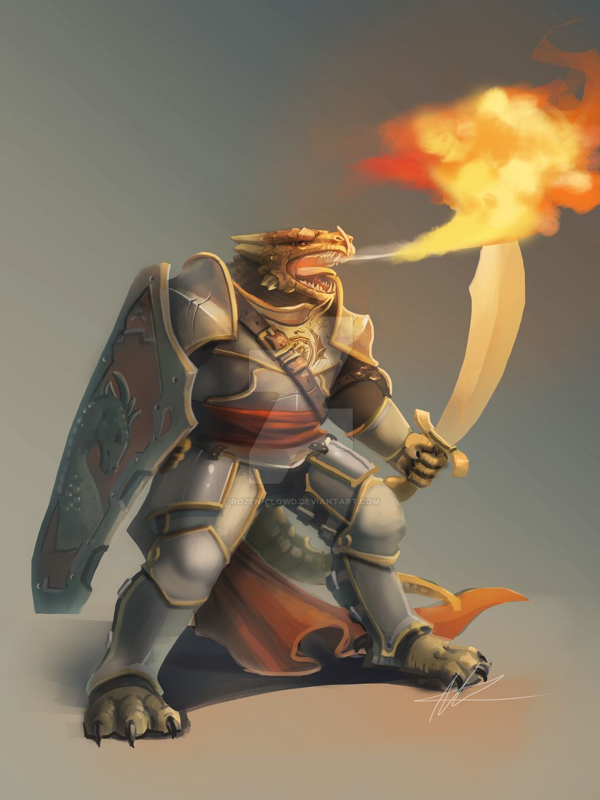

###### [&#9754; _Back to Main Page_](https://jackphillipsjmu.github.io/dnd)
---

# Redd the Illuminator

| Name                  | Race       | Class   | Portrait            | Last Campaign | Status |
| --------------------- | ---------- | ------------- | ------------- | --------------| -------|
| Redd the Illuminator         | Dragonborn      | Paladin    |  | Carnival of Synn | Alive |

## Backstory
Redd is a distant descendant of the Platinum Dragon Bahamut and is the second child in his family. He was born into the paradise that is Mercuria, the second layer of the Seven Heavens of Mount Celestia where Bahamut’s jeweled palace shines brightly in the warm golden light of the Astral Sea ruled by Torm.

Being the second born son, Redd lived a a life of servitude which led to him pursuing Knighthood at the age of 15 when Dragonborn males reach adulthood. Redd was sent to the fifth layer of Mount Celestia, Mertion, which served as a mustering ground for Paladins and other lawful servants to prove to himself and his family that he had what it took to protect the Seven Heavens. On Mertion he trained under Kuyutha to become a Knight worthy to serve at Bahamut’s Palace while adopting the livelihood of the Paladins that surrounded him to fulfill his duty to his family and realm. After completing his training Bahamut’s Brother Erakax, the Tyrant and Lord of Fear, began his journey to conquer all Earthly realms with his sons Baxiros and Qelmash. Fevered skirmishes ensued both in Celestia and the mortal realms that took countless lives and made the less faithful question not only if this fight could be won but their Sacred Oaths as well. As the tides began to shift towards Erakax’s legion the only hope to quell this evil was to travel to the Earth and acquire rare magical items to defeat Erakax. Given the advisement of Bahamut’s brother Sasashi, Redd’s brother was selected to gather these items at all costs and bring them back to defend their homeland. Word of this traveled fast in Erakax’s camp and before Redd’s brother could descend from Celestia he was struck down and put into a tomb of enchantment where he can not escape until Erakax and his legion are vanquished. As a last resort Redd was enlisted to bare the burden of retrieving the magical items to defeat Erakax and not only save his Brother but civilization as we know it.

Redd is desperate to please his family and save all those that he holds dear in his heart. With no direction to go in he descends to Earth and trudges through the landscape for adventurer's that will be at his side to traverse the difficult path and save Celestia.

###### [&#9754; _Back to Main Page_](https://jackphillipsjmu.github.io/dnd)
