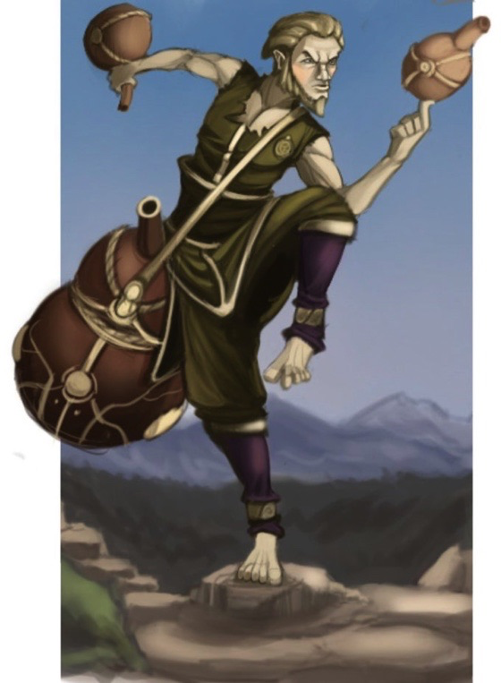

###### [&#9754; _Back to Main Page_](https://jackphillipsjmu.github.io/dnd)

# Skógur Strákar

| Name                                      | Race       | Class | Portrait      | Last Campaign | Status |
| ----------------------------------------- | ---------- | ----- | ------------- | --------------| -------|
| Skógur Strákar (_translation Forest Lad_) | [Wood Elf](https://forgottenrealms.fandom.com/wiki/Wood_elf) | [Monk](https://forgottenrealms.fandom.com/wiki/Monk) |  | Tomb of Annihilation | Alive |

## Backstory

### Early Days
Born in [Evermeet](https://forgottenrealms.fandom.com/wiki/Evermeet), the Green Isle. It is the last true kingdom of, and the final destination for all non-drow Tel'Quessir ("elves") on [Faerûn](https://forgottenrealms.fandom.com/wiki/Faer%C3%BBn).

#### Skógur's Parents and Their Demise
- Skógur's Parents were described as joyful, optimistic, fun loving, passionate environmentalists (liberal wood/wild elf heritage).
- Moved to Evermeet during the "Retreat" out of necessity. The Retreat was a mass migration of elves from [Faerûn](https://forgottenrealms.fandom.com/wiki/Faer%C3%BBn) where over 90% of the elves in the forest of Cormanthor migrated to Evermeet or Evereska. They had distain for how non-elven creatures where not able to gain entry into Evermeet as they wanted everyone to live in harmony together despite their race or upbringing (helps future plot holes of meeting/befriending [Arilyn Moonblade](https://forgottenrealms.fandom.com/wiki/Arilyn_Moonblade)).
- They birthed the first child in Evermeet after the "Retreat" once arriving. However, the child had a nasty tooth infection that led to the parents relieving the pain with traditional herbs and strong mead to dull the suffering (lends to arc of Drunken Master).
- Shortly after the Queen of Evermeet was met with tragedy following her husband Zaor Moonflower's assassination. The Sad Queen Amlaruil Moonflower took a liking to Skógur's parents for their optimism and new born life entering the realm.
- Once becoming friendly with the Queen she appointed Skógur's parents to investigate unrest in the Tethir Forest (named Wealdath, i.e. "unspoiled woods" by Elves). This was known as the Tethir Conflicts where during the Year of the Wave, 1364 DR, a mercenary named Bunlap ran a logging operation in the eastern part of the forest. During this time his men were killing and enslaving many elves while destroying the forest land. As Wood Elves, Skógur's parents took to this assignment with great determination to both help protect all life be that Elvish or the forest itself.
- Under the assurance from the Queen that they would just be reporting back to Evermeet on the ongoing Tethir Conflict they brought their newborn child to the Tethir Forest with them.
- Upon arriving they met a Harper, [Arilyn Moonblade](https://forgottenrealms.fandom.com/wiki/Arilyn_Moonblade), and bonded over their shared interest of maintaining a balance between civilization and nature.
- Unfortunately, during the skirmishes that ensued both of Skógur's parents were killed and he was left helpless and alone.
- [Arilyn Moonblade](https://forgottenrealms.fandom.com/wiki/Arilyn_Moonblade) after hearing of their death took pity on their child and took him into her possession. In the nights to come, she would calm the child's pain with strong mead and rolling her Silver ring bearing the symbol of [Mielikki](https://forgottenrealms.fandom.com/wiki/Mielikki) across her battle-worn fingers. However, it dawned on Arilyn that her obligation to the Harper's was not fit for a child and would need to find a proper home for him. After searching for someone to take the responsibility she passed him along to a sect of Monks that she had met on the outskirts of the forest at a monastery that was engulfed in foliage and well suited for the young Wood Elf.
- Skógur was taken under the wing of [Rassinn](https://www.indifferentlanguages.com/translate/icelandic-english/rassinn), a more senior member of the monastery where he quickly became a Father figure to Skógur.

[_Back to Top_](#top_of_page)

### Rassinn Skógur's Father Figure (NPC)
- Rassinn is jovial while being bound to mother nature and what she produces. He is a Male Half-Elf and is the longest-living person at the monastery at age 102.
- Rassinn was a former member of the [Harpers](https://forgottenrealms.fandom.com/wiki/Harpers) in his youth before settling down to live his life at the monastery. The fact that Arilyn Moonblade was a Harper herself made his bond with the child even stronger and also re-opened the door of communication between Rassinn and the [Harpers](https://forgottenrealms.fandom.com/wiki/Harpers).
- The monastery and Rassinn take a liking to [Mielikki](https://forgottenrealms.fandom.com/wiki/Mielikki), the Forest Queen, as the earth gives us grapes, wheat, barley and other means to ferment beverages to share amongst their brethren. This is also why initially the Monks liked [Arilyn Moonblade](https://forgottenrealms.fandom.com/wiki/Arilyn_Moonblade) due to her silver ring bearing the symbol.
- Since Rassinn took in Skógur as a young child they've grown an attachment to each other that only death could sever. Rassinn and Skógur are bound to each other as almost a Father/Son duo.
- Rassinn, along with the other Monks want to test their personal and spiritual growth to further their journey through the world around them. This (sometimes while inebriated) decision enables the Monks to venture out of their comfort zone into the world because it's a "norm" amongst their congregation and seen as a way to enlighten themselves. However, this comes at a fault as they can be too ambitious and overreach their capabilities.
- For the Campaign, Tomb of Annihilation, we needed to tie in a NPC Hamwert Spliff into our backstories. Here are some details on that relationship:
  - **How did Skógur Meet Hamwert the NPC?**: Met while Hamwert was traveling where he visited the temple where Skógur was training. They shared many Monk brewed ales and would talk until dawn about Hamwert's adventures.
  - **In what ways do you remain in contact with this Hamwert?**: Skógur and Rassinn grew close with Hamwert and stayed in contact through letters and would always welcome him with open arms into the monastery when he was traveling.

  

[_Back to Top_](#top_of_page)

### Death Follows, Skógur and Rassinn's First Trip to Chult
- After hearing word from former Harper comrades that there is unrest between a few tribal families in Chult Rassinn views this as a worthy challenge to better himself and teach Skógur through an example on the journey.
- With little experience outside of exploring the surrounding area of the monastery both Rassinn and Skógur depart towards Chult.
- Once arriving and getting attuned to the few explored areas of the peninsula Rassinn is confident that they can go off to find the cause of the curse and try to resolve it.
- Quickly after venturing into the unknown, naive Skógur leading the way through the dense jungle triggers a trap after stepping on a vine that quickly recoils back into the tree line and expels a black smog closely behind him. Right, where Rassinn is standing.
- Gazing upwards at the canopy of the jungle Skógur's attention is quickly diverted to guttural choking sounds coming from the smog that has descended to the ground behind him. In a fleeting attempt, he turns around and dashes towards his beloved friend to help.
- As Skógur steps within feet of the black cloud his eyes begin to burn, his throat starts to close and his energy is drained as he falls to the ground unconscious.
- Upon awaking soon after, the smog has cleared, but Rassinn body lays motionless on his back a few feet from him.
- Skógur pushes himself from the jungle floor and staggers towards Rassinn in a daze noticing his companion taking short laborious breaths.
- Grabbing Rassinn's tunic with both hands he pulls him up trying to jostle him awake but only a thin film of dark foam spills from his mouth. Desperate, Skógur hoists Rassinn onto his shoulder and staggers back up the path they came. Each step he takes Rassinn's breath becomes weaker and for seemingly the first times in his life panic sets into young Skógur.
- Within 100 paces of the last inhabited settlement they had passed through Rassinn breathing stops and Skógur flips his lifeless body to the ground shouting to [Mielikki](https://forgottenrealms.fandom.com/wiki/Mielikki), [Silvanus](https://forgottenrealms.fandom.com/wiki/Silvanus), [Solonor](https://forgottenrealms.fandom.com/wiki/Solonor_Thelandira), and any mortal or variant that who can hear to help bring him to save his dear friend.
- No one came to their aid and Rassinn takes his last breath as Skógur cries out just beyond the entrance OF the thick jungle.
- Defeated, Skógur ventures back to his monastery dragging the fallen Rassinn on a makeshift stretcher to be buried on the grounds amongst the other deceased Monks.
- Once back at the monastery, desperate for guidance, Skógur writes to Hamwert telling him of Rassinn's death and how lost he is without him. While awaiting a reply, Skógur drowns his sorrows in casks of ale and mead while reading through scrolls to try to find a way to save Rassiinn.
- Either at this point no response comes from Hamwert, causing Skógur to venture out to find him, or, another letter arrives detailing how there may be a way to save Rassninn's life through a Resurrection spell and he should leave to meet and go over details.

[_Back to Top_](#top_of_page)

## Wood Elf Race
Wood elves were easily identifiable by their coppery skin and green, brown, or hazel eyes. Wood elven hair was usually black or brown, although hues such as blond or copper red were also found. Wood elves tended to dress in simple clothes, similar to those of the moon elves but with fewer bold colors and a greater number of earth tones that blended into their natural surroundings. Accustomed to a harsh, naturalistic lifestyle, wood elves loved to wear leather armor, even when they were not under immediate threat. Wood elves were roughly identical to other elves in height and build, with males larger than females. Wood elves were often stronger than other Tel-quessir, including other elves, but were frequently less cerebral than moon and sun elves, who put a greater value on education.

[_Back to Top_](#top_of_page)

## Abilities, Feats and Supplies
- **Darkvision**: See in the dark up to 60 feet.
- **Keen Senses**: Proficiency in the Perception skill.
- Being a Monk S is proficient in Stealth, Acrobatics and Brewer's Supplies
- **Fey Ancestry**: You have advantage on saves against being charmed, and magic can’t put you to sleep.
- **Trance** ability means Skógur does not need to sleep but only meditate 4 hours a day.
- Feat is **Alert** which gives me +5 bonus initiative and I can't be surprised while conscious and other creatures do not gain advantage on attack rolls as a result of being unseen by me.
- **Elf Weapon Training**: You have proficiency with the longsword, shortsword, shortbow, and longbow. Typically, you dedicate yourself to a specific weapon and get an additional unarmed strike action which for Skógur is the longsword.
- **Fleet of Foot**: Your base walking speed increases to 35 feet. Speed increases by 10 feet while Skógur is not wearing armor or wielding a shield.
- **Mask of the Wild**: You can attempt to hide even when you are only lightly obscured.
- Not strong and has no armor equipped which can be dangerous. Skógur relies on movement during combat.
- **Brewer’s Supplies**
  - History: If people were drinking at an event I get additional History checks.
  - Medicine: Can use alcohol to dull your pain and treat people with alcohol poisoning
  - Persuasion: Can help mellow peoples mood with alcohol which may be good to get information from people.
  - Purify Water: Up to 6 gallons with a long rest
  - Can help detect poisons, identify alcohol, ignore effects of alcohol
- **Herbalism Kit**
  - Find plants
  - Identify Poisons
  - Help spot sources of food
- **Languages**: Common, Dwarvish, Elvish

#### Level 2 Upgrades
- **Ki**: Ki features some fantastic options for combat that can use your bonus action to maximize action economy.
- **Flurry of Blows** (not great at lower levels): You can either do Flurry of Blows for a total of three attacks or the extra attack from Martial Arts for two, not both. Still, Flurry of Blows is a solid way to get in more damage.
- **Patient Defense:** The Dodge action is a great way to avoid taking damage. When your health is low this is a great fall-back option.
- **Step of the Wind**: Step of the Wind grants some good in-combat mobility options.
- Increase walking speed to 45 feet.

#### Level 3 Upgrades
##### Monastic Tradition Way of the Drunken Master
- **Drunken Technique**: Somehow in your drunken stupor you can combine Flurry of Blows with the Disengage action and heightened mobility. Great for weaving in and out of combat.

[_Back to Top_](#top_of_page)

------------
###### [&#9754; _Back to Main Page_](https://jackphillipsjmu.github.io/dnd)
